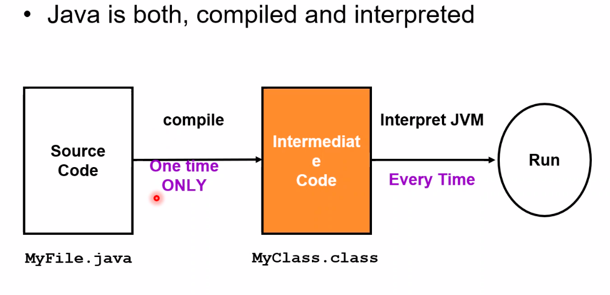

# JAVA programming  1st lecture Notes

- java output is target indpended you write code on any paltform and 
    built it and you can run it on any paltform

   
- jcp.org -> java community process technical website 

- jsr -> java specification request 

java flavors 

- java se -> standrd edition ->  syntax-> desktop application 
- java me -> micro edition   ->  
- java ee -> entrprise edition -> for servers , web application , entrprise appplications 

## how java is machine independent 

- this done by java virtual machine JVM is abstract layer between operating sysytem and hardware 

so code writting is for JVM 

and JVM do mapping for underlaying operating system 

- Java is comipled or interpretted 
 it work with both 

- source code compiled one time and output is .class file and whrn run over 
any platform JVM is mapping it to the underlayig layers operating system and HW 

- JVM is not suffiecient to run application  so JVM + libraries create JRE 

which is java runtime environment which is installed on  platform it has a 

builtin interpreter 

- JRE + compiler and utilities whill create JDK java development kit 

- to develop application we need JDK but to run application is suffiecient to have JRM because it will interpet binaries to operating system 

- java is multithread language by default 

- java in networked support (tcp - udp )

- if one file contain mutible class and copiled thriugh javac enery class will out as java.class 

### public static void main 

- JRE who will call main so main is public to be accessable out side class 

- static is to make JRE to call main without creating instance of calss 

- void no return 

- Strings [] args -> to take argument from terminal and store it in the array of strings 

- at least one public class in file 
- when there is public class in file , file name must = to calss name 

- package is some of files add package in code header and folder name and compile as javac -d pathOfPkcg file.java 

- to create a compressed JAR file copressed file 
    jar cef hello.java  app.jar HelloWorld.class

    to run jar file -> java -jar file.jar 

- to make it exctable er need manifest file which is contain the class who has the main methid 

jar cef <entry-point> <archive-name.jar> <files>

### Applets 

is an java application run in web page 

it my downloaded to user machine wuth .class extension and will be interpreted for user machine 

- applet has a life cycle which is some call back functions 

- callback method is a methods that called  automatically without any developer call 

- never make calling for call back function by yourself it will generate unknow behaviour  

- how developer affect -> it to understand functions and add his code 

- calling an constructor of applet object using dedefalult constructor 

- applet manager who called applet constructor 

- init() method is run one time only 

- start() method can clled many times the first time after init 

- paint() method is resobonsible for ui and may callad many many many times 

- stop() release reousrces temprorarly and it may wwhem user minimize browser 
        if user return browser agin start() called agin 

- destroy() if user close browser stop called and then destroy called this will release resources parmenant 

- any class in java.lang is included by default any calss outside java.lang it must by explicit importing calss 