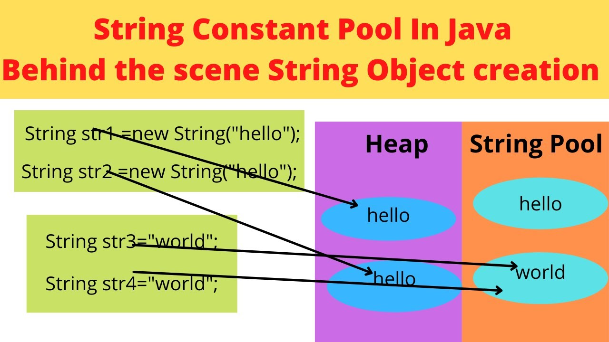

# data types and operators 

- role of naming name can start with 
  - letter a
  - $ 
  - _ underscore 

- data types 
    - primitive 
        - byte , int , short , long , float ,double , char " unicoded characters ", boolean "1 bit"
    - reference 
        - array 
        - class 
        - interface 

- Each primitive data type has a wrapper calss 

```java 

class wrapper {
    public static void main(){

        Intger i = new Intger(5); 
        
        int pi = i ; // auto outboxing 
        i = 10;  // auto inboxing  
    }
}
``` 

- object class is the parent class of any class you create in java , amy class you create in java will inherite this class methods and values 

- casting from smaller data types to larger data type done  imlicitly
- casting from larger data type to smaller must done explicitly 


- ### loggical operators 
    - istanceof -> check if object is instance of class 

  ```java 
  if(x instanceof calss name){
    //statment 
  }
  ``` 


## Reference types 
- arrays , classes , interfcaces

```java 
myclass obj // obj stored in stack 

obj = new myclass(); // mycalss in heab 
```

- object delted from memory using garbage collector when there is no reference point to it 

- ###  is that valid to inforec garbage collector to work ?
    - no you just request , and it has the right to work or not this request done by 
    ```java 
    System.gc(); 
    ``` 

```java 
    // accessing a refrence point to null ana you call a instance member from it 
    String str ;

    str.lenght(); 
    // this eill return an null pointer exception 

``` 
- **using local variable if it not initialized will return a compiler error** 

## Array of primitives data types   
-**note array is a refrence type , array refrence is stored in stack**
- allocate memory for array in heap 
```java 
int [] myarray = new int[3]; 
``` 
- allocate and intialize in same line 
```java 
int[] myarray = {1 ,2 ,3 ,4};
```

## array of refrence types 


## strings 
- never use == with string ,there is a class method to use 
```java 
String mm = "mahmoud"
mm.equlas("mahmoud")
``` 
- string concatination 
```java 
String str = "mahmoud" ; 
str+= "mohamed"; 
// str = mahmoud mohamed 
``` 
- string is imutable is constant becasue array is fixed size and string is array of character so it can't change array size 
- **how conctinate done**
    - concatinate done that implicitly create new object with the new size and put conctinated string in new locations and the change refrence to it and the old object will delted with garbage collector 

- **string pool**



```java 
String name = "mahmoud" ; 
String lasname = "mahmoud"

name += "ali"; 

System.out.println(lsname); 
// output mahmoud 
```

- labs 
    1- calculator suppot + - X / 

    2- ip cutter 
        192.188.123.22.2
        printed as 
        192 
        1288 
        122 
        

==============================================================
how can polymorphism is seen in attributes ? 
