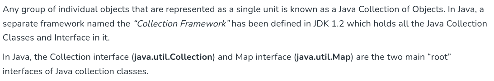

# java collection 

- what is the java collections ?



- collection of liwer case represent data structure 
- Collection of upper case is the java coolection which is set and list ad queue iherit interface Collection 
- Collections calss that contain a utility methods for use with collection lower case 

- the java collection 
    - generic type that 

- there are 3 groupts of collections 
    - sets -> store this element 
    - sequences -> 
    - maps 
- all collections of refrece types no collection for premitives data types 


- sets is unique thing (classes that impelement set ) if you need data structure to store unique object if you doublicate any element will not 
- squences -> (classes impelemnt list) care about index

- maps -> store data in key value pairs it takes object with uniqe key "unique on key not the object "

- there is 3 classes impelement stes
    - hashset 
    - LinkedHashset 
    - treeset 

- sorting assending or dessending 
- ordered the proceesing oreder 

- hash set 
code is uniqe for each object from   
    - method that called hash code retur intgers if you write a class its your responsability to override hash code function for this class 

- Linked hash set 
    - is unique abecause it set and depend on hashcode function and implemented in linked lsit 
    - linked list contain uniqe objects based on hascode 
    - maintain double linked list  , it fast in processing data , and ordered due to insertion in list 

- tree set 
    - store data  in sorted way due to tree impelementation  and orderd in natural of objects if not you need to iplement compare class  and override compare function to order objects  


## Squences 

- List -> care about index  so its method use index to find or set element 
    - arrayList -> its mehods it not thread safe used for just iteration 
    - vector -> its method synchronised for thread saftey so if you have multi threading it presffered to use Veactor 
    - Linked list -> used for fast insertion and deletion 

- Queue 
    - FIFO 
    - priority Queue


- maps 
    - hash map -> use keyvalue depend in hash code for key because key is unique   no order 
    - hash table -> use key value and oredderd and its method is synchronised for thread saftey 
    - linkedhashmap -> orderd but not thread saftey and faster iteration 
    - treemap   -> key value and sorted and ordered due object natural if not impelemnt comparetive interface and override compare method to order objects 

- **Iterator** 
    - is used to iterate in sets and sequences and not used with maps , map has a method that return map content as set and then can use iterator on it to iterate on it 
    ```java 
    for(map.entry m : hm.entrySet()){
        System.out.println(m.getkey()+ "" + m.getValue); 
    }

    - iterator() return an object form class Iterator and use hasNext and NExt methods to iterate 
    - u can use enhanced for loop to loop in lsit and sequences 


## how to store data 
```java 
 List myIntList = new LinkedList() ; 
 myIntList.add(new Intger(0));

 Intger x = (intger) myIntList.iterator.next() ; // this casting because object rrefrence from child an object from parent calss 
 
 ```

 - to avoid casting problems 
    - use generics 
    ```java 
    list<Integer> myIntList= new LinkedList<Integr>(); 
    myIntList.add(Integer(5)); 
    Integer x = myIntList.iterator.Next(); 
    ```

 # Socket Programming 
- TCP 
    - connection oriented two devices must be online 
    - connection stream 
    - Reliable 
- UDP 
    - connection less 
    - 
    - unreialbel 

- Socket = adress + port for the farest if you in servier the socket represent clinet , if you in client the socket represent the server 
- socket by default run over TCP 
- in running server and client running , you must run server at first . 

- **client server communication** 
- create server socket it just listen for connection 
- clinet has a socket wich is ip of server and port number 


- accept() method  know the ip of the clinet and generate a virtual port 


