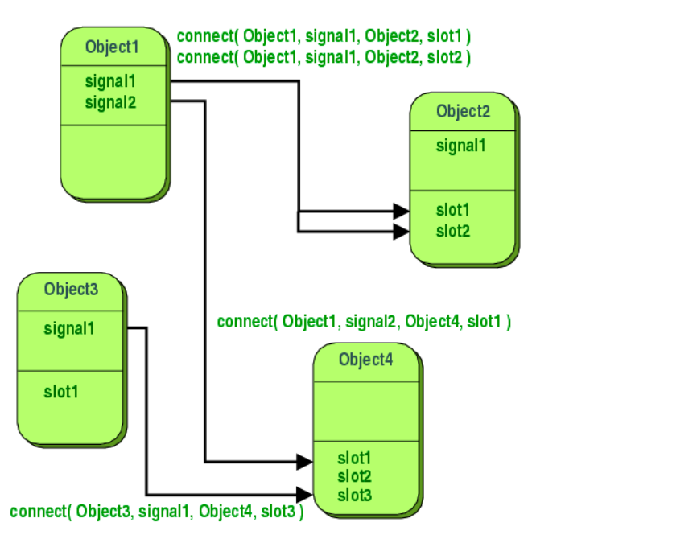
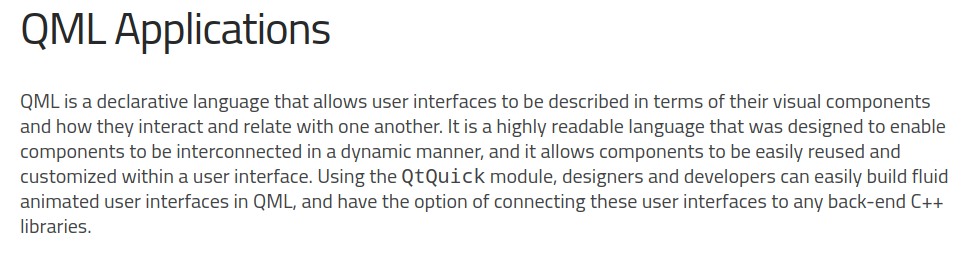
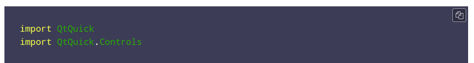
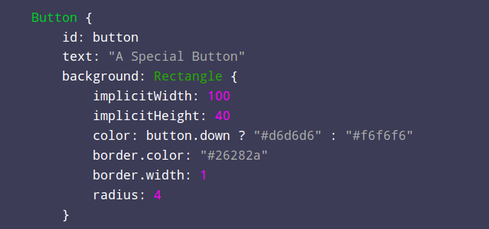
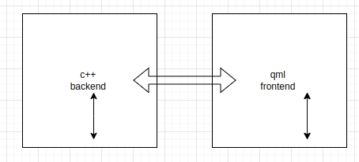

# qt what is qt ? 
**qt is frame work is used to build cross paltform applications is comined form this structure** 
- modules 
- libraries 
- tools 

- **modules** 
- modules content of headerfile 
    - header files contain of cpp classes  

- modules partitioned to 
    - qt core -> for non gui application  
    - qt widget -> for gui applications for desktop applications 
    - qt quick  -> for gui appications for mobiles and supported touch screen for devices 

eg : main.c 
```cpp 
#include<QPushButton>
int main(){

    QPushButton button("press"); 
    button.show(); 
}
```

**what is library** 
is content from 
- binary 
- libraries for each qt modules 

**to copmile application to run over machinnes** 
- source file -> qmake 
- variaable  qt=core or widegets or quick  -> .pro-> qmake v
- qmake -> make file to compile application and genrate exe 

**TOOLS**
- META OBJECT COMPILE -> moc 
- qt resource  compile -> rcc 


```cpp 
return a.exec() ; 

```
this a event loop which is make application non end onece it run 

this heard an eventts from os that will do an action whern the event is done by go to event handller to the event done 

you can find description in hep system by using f1 over funtions you need 


- **Qdebug** 
#include<qdebug>
 - is a class support some macros and functions 

 - qInfo()<< -> act like cout but in easy way 

- qdebug()<< ->  info for debugger 

- qwaring() ->  info for user 

- qcritical() -> is a fetal masseage for user 

- qfetal() -> will print message and will  terminate application 

**qstring** 

#include < Qstring > 

- why use qtstring 
- suppotr many functions 
- if qtfunction take a string in its parameter as qtstring so if you need to call this fuinction you havee to pass qtstring 
  orcast stdd string to qt string 


- **how to add new class**

- on project add new 
- select calss 
- add class name 


- **how to link between classes** 

- calss 1 
    - has timer after some time need to invoke function in another calss 
        - my use callback function this is the difficult way 
         - may use signals and slots is qt functions that will make it easy **note you need to enable signal and slots in your class**
            - connect(obj1 ,signal , obj2 ,slot )


- **what is signal and slots**

- In Qt, we have an alternative to the callback technique: We use signals and slots. A signal is emitted when a particular event occurs. Qt's widgets have many predefined signals, but we can always subclass widgets to add our own signals to them. A slot is a function that is called in response to a particular signal. Qt's widgets have many pre-defined slots, but it is common practice to subclass widgets and add your own slots so that you can handle the signals that you are interested in. 



- **how to enable signal and slot in class**

- all class inherite from qobject can contain signals and class 
- you can make this through gui by iherit qobject and q_object macro 
- **signal is not function it just prototype**
- to lanch signal use **emit** keyword in function that will invoke signal 
- signals in class are defined under signal: 

- slots aredefine in class under slot: 
    - slot must take same argument of signal 


## Qml 

- **whats is qml** 

 


**how qml interface with backend cpp code** 

- Using Signals and Slots:
    Signals and slots allow communication between QML and C++ classes. You can emit signals in QML that are connected to C++ slots, and vice versa.

**how to include module in qml files** 
- this done by using import keyword 
```QML
import qick 
```



**how to create an istance of an class in qml files** 



- **qml and cpp interace**



- theres is a ginal ans slots between qml objects and another qml object 
- there is a signal and slots between qml objects and cpp objects 


- **connectionelement** 

- target: propbertiy take id of element that generate signal 

- **cpp and qml connection throgh 