# OSI Architecure | TCP/IP architecture 
## layers of OSI architectiure 
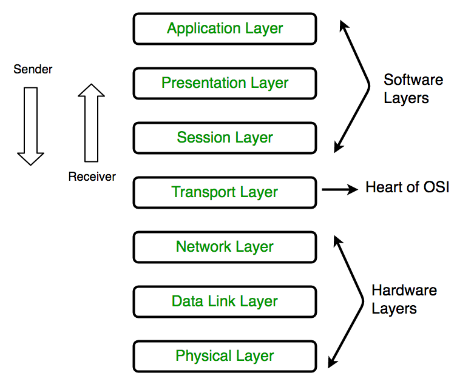

there is a 7 layers 

7.  application 

6. presentation 

5. session layer 

4. transport layer -> like [TCP - UDP ]

3.  Newtwork layer  -> its help to connect btewwen many networks   [ipv4 , ipv6 ] -> its cant not use network layer without layer 1 and layer 2 protocals to define data link layer and and physical layer that data will in 

2.  data link layer -> the structure of data frame -> wich is a logiacal frame / its define the fram of protocol  

1. physical layer  -> it has a stander to define how to impelemnt HW of and data that will be on bus (its may be wired an wier less )

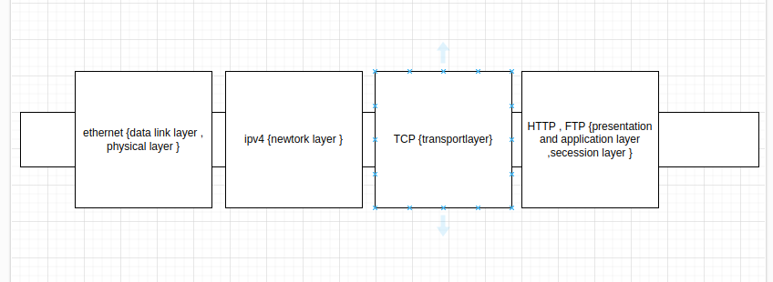

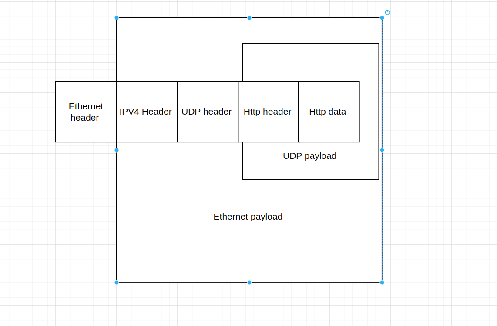

## why ethernet join automtive industrie 
after the invension of Broader-r Reah 
jsut to wires you ca send and recieve in same time 
Innovative BroadR-Reach technology extends the range of twisted-pair connections so that Ethernet and IP services can be deployed for longer reach with more cost-effective cabling.
BroadR-Reach extends the connection range from 100 meters up to 1000 meters for various speeds and multiple cabling options to provide flexibility for Ethernet deployment.
Broadcom’s Industrial BroadR-Reach portfolio includes Single and Octal PHYs and a switch offering which has integrated BroadR-Reach transceivers.
Additionally, BroadR-Reach is compatible with Power over Ethernet, greatly expanding the range of applications for POE appliances.

automotive Ethernet sared data link layer with the ordinary Ethernet but it different in physical layer -> in automotive it use two wire bus and BroadR-Reach
## TCP/IP layers 

- seesion and presentation layer in OSI has no specific standrd so in TCP/IP collect them in one layer and rename it as APP Layer 

---------------------------------------------------------------------------------------------------------------------------------------------------------
phy to phy  conneted throw media dependent interface  MDI 
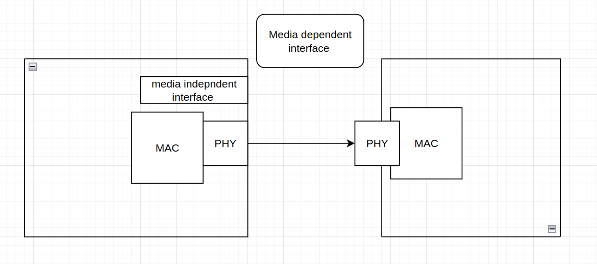

## mac and phy are talking throw 
MII , RMII , RGMII -> it different speed , media independet interface wihch is the communication protocol between phy and mac it seem I2c 
there is 16 wire between phy nad mac 2 wires are act as i2c 
## how to set speed of mac and phy communication 
thrwogh microcontroller code initiate mac to communocate with speed and mad initiate phy with this speed 
## wht is the meaning of link up 
there is a hardware test between phy master and slave ohy to check tha speed and sampling rate is the sane 
"Link up" means that this connection process was successful. The two PHYs have successfully negotiated and agreed on parameters such as speed, duplex mode (half or full duplex), and other necessary settings

.
## phy are contained from layers 
1- pcs physical coding sublayer 

3- PMA physical media attatchment -> its work is to know what you recive beacuse  you can sen and recive in same time so bus contain the send and recived data so its work is to know the recived data from the total data using echo cancle 

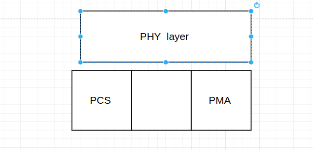

## namming convension of BoardR-reach 

100 BAse -t x 

100 -> speed 

t - medium twisted pair fiber 
x  encoding methodology 

----- 

## Data link layer on Ethernet  

## untaged frame 

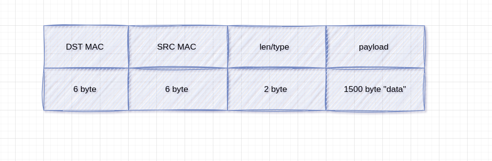

 ### as reciver 1st check if destination make is same to mine i will recive frame if not i will not recive this frame 
 if dest address is filled with ff this mean it is a broad cast 

 ### second parse len/type 2 bytes 

len (2bytes) -> is the data length if it was larger than 1500 it will be type -> there is standrd number for types eg. 0x0800 ipv4 data link layer parth len/type bytes if it was less than 1500 it will handel this frame by it self it was an ether net frame and not froward to upper layer 
 if it larger it mean that there is uppper layer need this frame and  it detect type of upper layer throw number and froward farame to this layer 

### taged frame virtula lan 

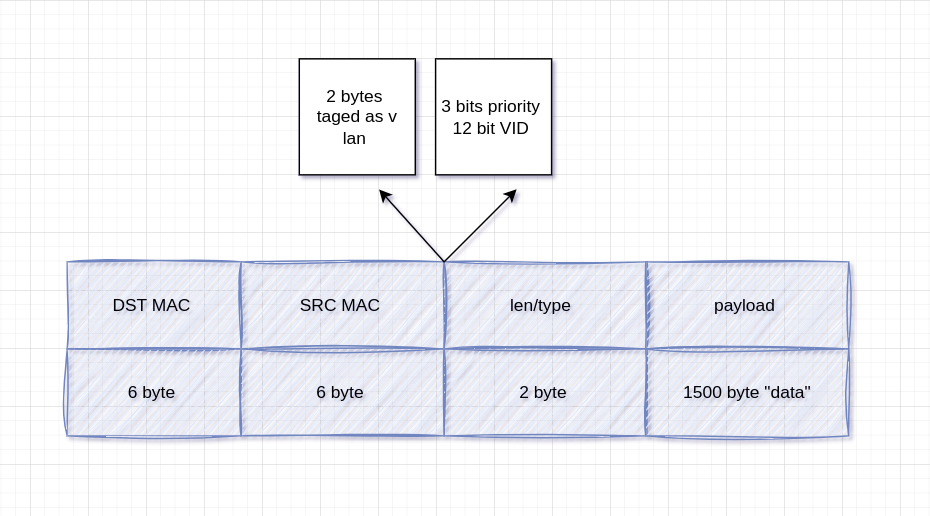

this 4 bytes defined that this frame is taged frame and to which vlan virtual lan this is act as local noetwork , this frame will send to 
devices belong to this vlan , if  ddevice is not belong to this virtual lan will drop frame 

### ethernet switch 

switch link one newtwork 

ethernet is a node to node protocol so act as master slave wee need switch to make a network of nodes make multi devices talk t each other 

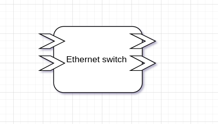

### traffic montoring controll 

1. you can confgiure switch to make ports to specific Vlan and when frmae tagged to Vlan and it was a proadcast frame switch will froward this frame to this Vlan devices only 

2. bu using destination MAC address route it to specific ports to reduce traffic  

3. T CAM -> filtering for example drop frames if it contain specific ip 

## how switch know the device who has this mac address 

switch will send frame to all ports which is fload , the device who has this mac address will return ack and this a switch auto learning mechanism when a device return ack the switch know that this port contain this mac address 

or you can coonfigure it each port has a specific mac addrss 

switch cant talk to device throw IP because switch is a layes 2 device which it frame dosent cantain an IP address 

- type of switching 
    - managment switch , has a cpu to route the frame for the specific mac adress 
    - unmanagement switch will only route data to all the ports all mac adresss 

### multicast is untagged frame  when this mac address come to switch it to sepecific ports , is not manadatory to to be untagged 

- type if ethernet casting frame 
    - multicast -> oen to n 
    - unicast -> one to one 
    - proadcast -> one to all

- i could make tagging for untagged frame by switch by configure if this frame come to you configure it as tagged for specific vlan 

# layer 3 Network layer 

## IP and subnetmask 
// study and fill 
ip header src and destination IP and prototcol bytes 

protocol layer determine which protocol application is used from the upper layer 

if it conatin 6 is  TCP layer 

if it 17 will use UDP 

##  how to devices in different newtwork communicate to each other 

- uising router  device  is a layer 3 device layer 3 protocol 

- switch link one newtwork and another switch link network to link these newtork together use router 

- time synch in car network using ptp over ethearnet protocol "precesion time protocol" 
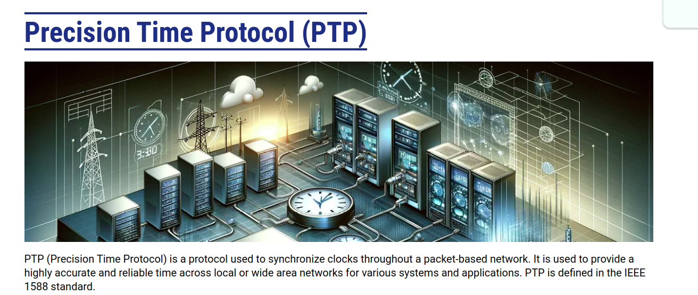

### if you have source IP and destination IP is that enough to send a fram? 

no , you need destination mac Address , so how to know destination mac address ?

using an ARP protocol which is send frame that contain an IP and wait to response from device who has this IP with it's mac address 

- router contain an Arp hash table that mapping the ip to specific mac address  

# layer 4 transport layer 

- TCP 
- UDP 

## UDP protocol 

is a connection newtork -> no need to stablich connection which is no ip valid ( start conection , send data , stop connection )

UDP header (src port , dest port , lennght , check sume )

portnubers  

-> 68 DHCP client is a laye 5 application 

-> 67 DHCP server 

client to server -> { src port 68 , dest port 67 }

server to client -> { src port 67 , dest port 68 }

is to take an IP from server client ask server if there is an valid IP and server retun that there is vaild one and then client take this IP , this IP valid for this clirent for specific time if this time ended , the server will assign this IP as free IP and if any one client ask for this IP again this IP if free to assign to it  or the client send another request to take new interaval if this ip this is a RENEW request also can change time for this ip  

## TCP protoclo 

- synch flag 
- ACK 
- FIN 

sync is to establish connection 

## DHCP sequence 

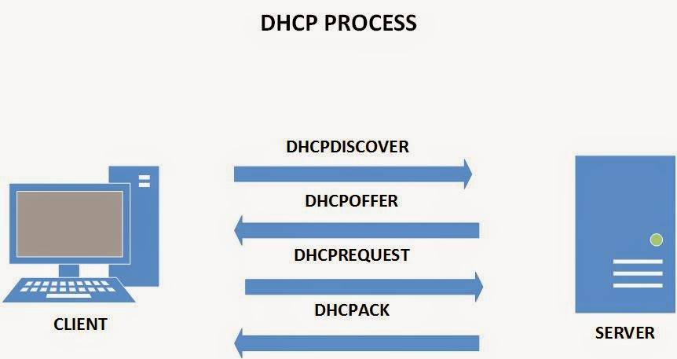 

https://www.eventhelix.com/networking/dhcp-flow/dhcp-sequence-diagram.pdf 

- type of DHCP 
    - static DHCP -> there is a condition with mac and ips in DHCP server know that this mac has this ip and can't send this ip to another device defined in DHCP impelementation 
    - dynamic IP  -> this is dynamic when clinet request an IP the DHCP server responed by any free ip 
    - static and dynamic , can handle static ip in static ip table and also can generate ips for newdevices in newtwork     

- discover frame
    - ethernet frame 
        - dist mac  proadcast -> send frame to all devices in network you  didnt know if there is a server or not and you didn't know the server ip 
        - src mac this is the mydevice ip 
        - ethernet type lenth 0x800 for ip version 4 
    - ip V4 header 
        - protoclo -> udp no connection established 
        - lenghth 
        - dest ip -> proadcast 
        - src ip  -> default ip all with zeros becasue i have no ip and iam not in network 
    - UDP HEADER 
        - src port 68
        - dest port 67 

    - DHCP header is fill with zeros 

- offer frame 

    - ethernet header 
        - dest mac -. DEVICE MAC   
        - src mac -> servier mac 
        - type -> ipV4 
    - IP V$ header 
        - protocol -> UPD 0x11 
        - DST ip -> default / or proadcast ip 
        - SRC ip -> server ip 

    - UDP HEADER 
        - DST PORT -> 68 
        - SRC port -> 67 
    - DHCP 
        - server MAC Address in ethernet layer 2 and in layer 7 
        - client MAC address 
        - offered IP 
        - Time 

- Request Frame
    - ethernet Headder 
        - DST -> srver mack 
        - src mac -> client mac 
        - type -> ip v4 

    - IP V4 header 
        - protocol 
        - src ip default 
        - dst IP -> server ip 
    - UDP Header 
        - Dest port 67 
        - src port 68 

- ACK Frame 
    - ethernet header 
        - dest mac -> client MAC   
        - src mac -> servier mac 
        - type -> ipV4 
    - IP V$ header 
        - protocol -> UPD 0x11 
        - DST ip -> default / or proadcast ip 
        - SRC ip -> server ip 
    - UDP Header 
        - Dest port 68 
        - src port 67        
    
# seesion 2 

## cyber security 

- **CIA**
    - cofidentiality 
    - integrity 
    - authinticality 

- if you need to apply any feature in cybersecurity and see what it acheive  from this list 

- cofidentiality -> confirm that user has an access in this data , has an access and didnt know sendr 

- integrity -> check data send from sender still the same until recived by reciver 

- Authenticity -> knowing the who send this data , has an acess and know the sender 

## encryption algorithms 
- **Syemetric key** 
    - achieve confedintiality 
    - dosen't achieve integrity 
    - dosen't achieve authenticalty 

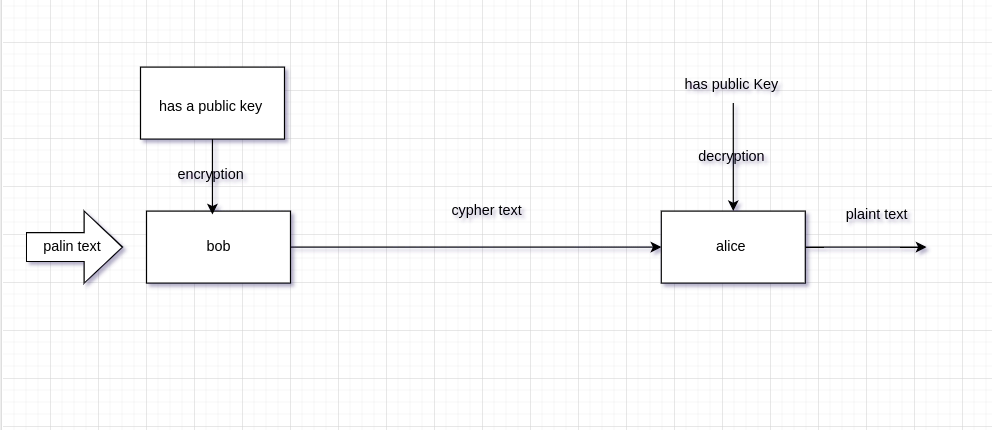

## A symetric 
- hashing

    - achieve confedintiality 
    - dosen't achieve integrity 
    - dosen't achieve authenticalty 

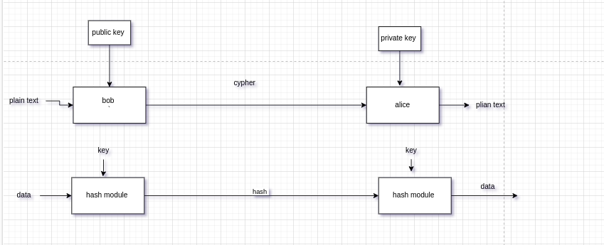

- **hashing calculated in private key and verified using public key** 

- **ptivate key** only one node has the ptivate key 
- **public key** many node can has the public key 

- **COMPARISON BETWWEN SYMETRIC KEY AND A SYEMETRIC KEY** 

https://preyproject.com/blog/types-of-encryption-symmetric-or-asymmetric-rsa-or-aes

- **man in the middle attack** 

- AES algo 
- DES algo 
- 3 DES algo 
- Difusiion feature for algorithm 

- **digital signature** 

- **HOW ETHERNET INCLUDDED IN AUTOSAR**

- ETHERNET SATCK becasue the ethernect cant talk with pdu's it know only socket 
- so wee need a module to convert from socket to pdu in autosar which Soad -> "soackt addpaet " and vice versa 

**Layers** 

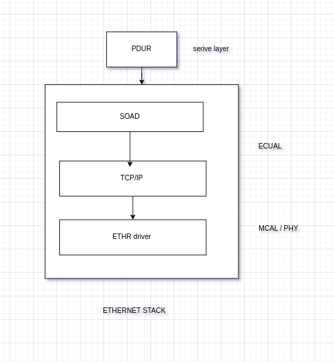

- SUM IP 
    - is a statndrd way to structre data in some how format , is a way in serializring data to send data using sum ip there is a module is ""service descovery""  there is a server provide server is a publisher and subscriptor is to subscripe for service 