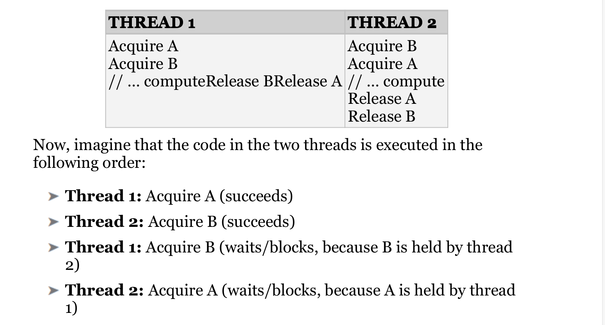

### Multithreading 
# there is three ways to excuting multible tasks 
1. Sequential execution: Each task is executed one after the
othe 
2. Concurrent execution: Multiple tasks can be executing
seemingly at the same time, but this can be because the
operating system is giving a task a tiny amount of time, known
as a time slice, to do some work, then giving another task a time
slice to do its work, and so on. This task switching keeps ongoing
until tasks are finished.
3. Parallel execution: Multiple tasks are truly executing at the
same time for example, on multiple processor units

## Race condition 
Race conditions can occur when multiple threads want to access any
kind of shared resources
Race conditions in the context of memory
shared by multiple threads are called data races
## how it deone 
Most processors have INC and DEC instructions to do these operations. On
modern x86 processors, these instructions are not atomic, meaning
that other instructions can be executed in the middle of the
operation, which might cause the code to retrieve a wrong value.
### Multi threading problems 
### Tearing 
Tearing is a specific case or consequence of a data race
1. tearing read 
2. tering write 

## torn read 
If a thread has
written part of your data to memory, while another part hasn't been
written yet, any other thread reading that data at that exact moment
sees inconsistent data: a torn read

## torn write 
If two threads are writing to the
data at the same time, one thread might have written part of the
data, while another thread might have written another part of the
data. The final result will be inconsistent: a torn write

### deadlocks 
. Two
threads are deadlocked if they are both waiting for the other thread
to do something. This can be extended to more than two threads. For
example, if two threads want to acquire access to a shared resource,
they need to ask for permission to access this resource. If one of the
threads currently holds the permission to access the resource, but is
blocked indefinitely for some other reason, then the other thread will
block indefinitely as well when trying to acquire permission for the
same resource 

## solutions mechanismis of dead locks 
One possible solution is to try for
a certain time to acquire permission for a resource. If the permission
cannot be obtained within a certain time interval, the thread can stop
waiting and possibly release other permissions it is currently
holding

### Fasle Sharing 

Most caches work with cache lines. For modern CPUs, cache lines
are usually 64 bytes. If something needs to be written to a cache line,
the entire line needs to be locked. This can bring a serious
performance penalty for multithreaded code if your data structure is
not properly designed. For example, if two threads are using two
different pieces of data, but that data shares a cache line, then when
one thread writes something, the other thread is blocked because the
entire cache line is locked. Figure 27.3 graphically shows the
situation where two threads clearly write to two different blocks of
memory while sharing a cache line   

## solution of cash line 
You can optimize your data structures by using explicit memory
alignments to make sure data that is worked on by multiple threads
does not share any cache lines. To do this in a portable manner, a
constant called hardware_destructive_interference:size , defined in
<new> , can be used, which returns you the minimum recommended
offset between two concurrently accessed objects to avoid cache line
sharing. You can use that value in combination with the alignas
keyword to properly align your data.

## automatically joined thread 
As discussed earlier, if a thread instance is destroyed that is still
joinable, the C++ runtime calls std::terminate() to terminate the
application. <thread> also defines std::jthread , which is virtually
identical to thread , except:
1. It automatically joins in its destructor.
2. It supports cooperative cancellation.

### cooperative cancelation 
The cancellation support of jthread is called cooperative
cancellation because a thread that supports cancellation needs to
periodically check if it needs to cancel itself. Before an example can
be given, two important classes need to be introduced, both defined
in <stop_token> :

### retriving result from thread 
For example, if your thread performs
some mathematical calculations, you really would like to get the
results out of the thread once the thread is finished. One way is to
pass a pointer or reference to a result variable to the thread in which
the thread stores the results. 

Another technique is to store the results
inside class data members of a function object, which you can
retrieve later once the thread has finished executing. This works only
if you use std::ref() to pass your function object by reference to the
jthread constructor

### ways of calling to pass function to thread 
1. lamda function 
2. function object 
3. function pointer 

### atomic operation library 

Atomic types allow atomic access, which means that concurrent
reading and writing without additional synchronization is allowed.
Without atomic operations, incrementing a variable is not thread-
safe because the compiler first loads the value from memory into a
register, increments it, and then stores the result back in memory.Another thread might touch the same memory during this increment
operation, which is a data race
it used with primitive data types 

### MUTUAL EXCLUSION
using mechanism of mutual exculsion 
1. A thread that wants to access (read or write) memory shared
with other threads tries to lock the mutex object. If another
thread is currently holding this lock, the new thread that wants
to gain access blocks until the lock is released or until a timeout
interval expires

2. Once the thread has obtained the lock, it is free to use the shared
memory. Of course, this assumes that all threads that want to
use the shared data participate in the mutex-locking scheme

3. After the thread is finished reading/writing to the shared
memory, it releases its lock to give some other thread an
opportunity to obtain a lock on the mutex. If two or more
threads are waiting on the lock, there are no guarantees as to which 
thread will be granted the lock and thus allowed to
proceed.

## types of mutex class 
1. non-timed 
2. timed 
both are recursive and nonrecursive usage 

## spin lock 
A spinlock is a synchronization mechanism where a thread uses a
busy loop (spinning) to try to acquire a lock, performs its work, and
releases the lock. While spinning, the thread remains active but is
not doing any useful work
Spinlocks can be useful in situations where you know the lock is
going to be held for only a short time

## non timed mutex class 
there is three types of timed mutex class 
1. std::mutex -. supported in <mutex>
2. std::shared_mutex -> supported in <shared_mutex>
3. std::recursive_mutex ->supported in <mutex>

### future and promise 
A future can be used to more easily get the result out of a thread and
to transport exceptions from one thread to another thread, which can
then handle the exception however it wants

A promise is something in which a thread stores its result. A future is
used to get access to the result stored in a promise. That is, a promise
is the input side for a result, a future is the output side. Once a
function, running in the same thread or in another thread, has
calculated the value that it wants to return, it puts this value in a
promise. This value can then be retrieved through a future. A
promise/future pair is an inter-thread one-shot communication
channel for a result.