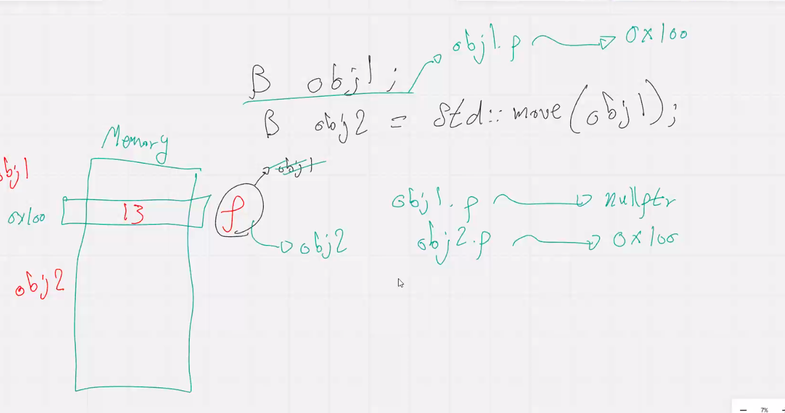

- **what is next** 
- boost frame work 
- socket programming 

# smart pointers 

- **row pointer problem**
    - dangaling pointers 
    - unuthorized access 
    - memory leak 
    - Double deletion -> delete poiter more than one time 


- smart pointer is an objetc store memory location and privide automatic memory managment 

- RAI "resource acusition Initialization"

- **smar pointers types** 

- unique-ptr<> 
- shared-ptr<> 
- weak-ptr  <> 

- ### unique pointer 

```cpp 
#include<memory>
std ::unique-ptr<int> uptr(new int (100)) ; 

/* this pointer has a unique ownership , cant assign this pointer to another pointer to point to the same memory location 

/*another way to define unique poiter and this is most recommnended */

std:: unique-ptr<myclass> uptr2 = std::make-unique<myclass >(/*may topass value*/); 
``` 
- **this way of define uique pointer is invalid** 
```cpp 
std::unique-ptr<int>uptr3 = new int(50); 
/*because this i considered as ownership movement which is not allowed in unique pointer */

```
```cpp 
std::uniqie_prt<int>p1(new int(100)); 

std::cout<<*p1 << p1.get()<<std::endl;

// *p1 get value 
// p1.get() return address 

int *c = p1.relaese() // remove ownership of poibter to this memory location 


std::move(p1) -> // this pointer now is a null pointer move will move ownership to anothier pointer and copy data inside pointer to the new ownership pointer 


 std::unique_ptr<datatype> getnewptr(){

    return std::unique_ptr<datatype>(new data type)
 }

 std::unique_ptr<datatype> pointer = getnewptr() // this line is valid the compile implicitly make it as move not a copy 

```

## shared pointer 
 
``` cpp 
#include<memory>
std :: shared_ptr<int>shptr(new int); 

/*prefered way */

std:: shared_ptr<int>shptr2= std::make_shared<int>(5);

/*
 shared mean that the same memory location can point with another pointer 

*/

``` 
- keep refrence count -> numebr of pointers point to the same memory location 
    - once all no shared pointer point to this memory location the locatinon is deleted from memotry 

    - this count wull increase only if the sared pointer point to memory location is located by shared poiter 
    
    - **how to know number of shred pointer point ti this location 
        shared_ptr use_count(); 
    


- shared pointer point to classic pointer will make an issue of 


- **shared pointer problem , the pointer will note reales by destructor ,** 


## Weak pointer 
```cpp 
std:: weak_ptr<int>wptr = shared_pointer ; 

/* the waek pointer will not make delete there is another one  who will made delete 

* it remove issue of circular refrence problem */ 

```


- **circular problem** // interview problem 


- **how to solve problem using waek pointer 


## Rules of cpp 
- is a guide lines used to hepldevelopers in manage resourcess and object life time 

- **rules types:** 
- rule of 0 
    - no define to anything ->  useed when no dynamic allocation inside class 

- rule of 3
    - destructor  / copy {constructor and copy assignment operator} -> when there is a dynamic allocation in class 

- rule of 5
    - destructor  / copy {constructor , assign operator } , move {constructor , assignment operator }
    -> when there is dyanamic allocation in class and neet to transfere ownership , instead of pointer ownership   from 1st object to ownership to the object number 2 and pointer of object null wull point to null ; 
    obj2 = std::move(obj1) -> will inforec move semantics 
            


- rule of zero 


- rule of three and rile of five 


interview question 

- what is rule of three , three , five 
- whats is the feature of reule of five more than reulr of three 
- what is the problem solved by rule of three 
