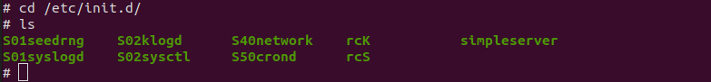
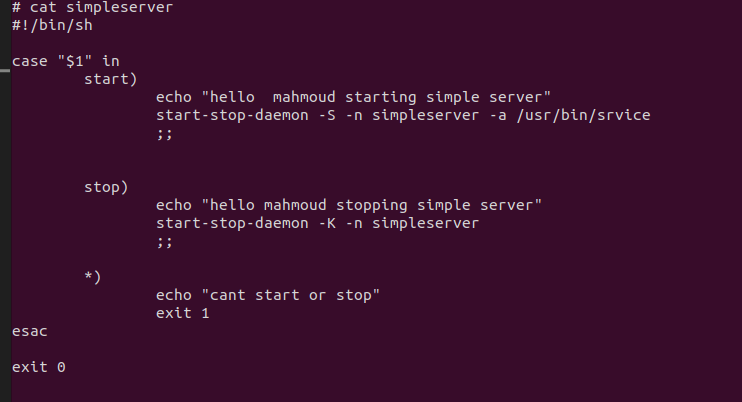
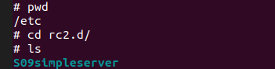
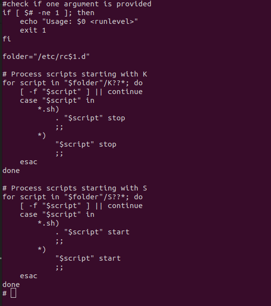
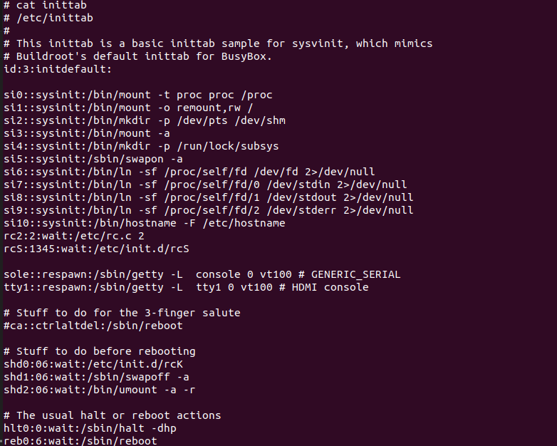

# creating new run level contain service to run when swithc ths ru level 
1. Botting bulid root built image ob rasraspberry pi and connect wiht shell using uart through ttyUSB0 and pioccom by 15200 buad rate 
``` bash 
sudo picocom /dev/ttyUSB0 --baud 115200
```
2. in /etc/init.d create servics script that will run at this level 


3. write srvice script that check on service start and stop 


    to strat service use the following command 
 ```bash 
    start-stop-daemon -S -n simpleserver -a /usr/bin/srvice
``` 
- start- stop-daemon -> start-stop-daemon is a helper function that makes it easier to manipulate
background processes 
- -S -> It starts the daemon withthe -S parameter
- simpleserver -> service name 
- -a /usr/bin/srvice -> path of binary file of service need to run 

    to kill service run the following command 
 ```bash 
    start-stop-daemon -K -n simpleserver 
```   
- -K -> for killing service 
- simpleserver - > service name "not binary file it's service name "

4. under /etc/ create un level directoy /etc/rc2.d

* this directory contain symbolic limk for the process S09simpleserver
the name of symbolic link 
- S stand for start this srvice when chage to this run level 
- 09 -> oreder in which script will run 
- simpleserver -> symbolic link name 

5. creatin rc.c script that will parse the symbolik link name and see if service run or killed in this run level 


6. add run level in /etc/inittab script 
 
``` bash 
rc2:2:wait:/etc/rc.c 2
```
- rc2 -> the name of the directory that contain symbolic link 
- :2: -> the number of the run level 
- :wait: -> wait: The wait action tells the init process to wait until the specified command (in this case, /etc/rc.c 2) has finished executing before moving on to any other commands that are listed for the same runlevel

- :etc/rc.c 2 -> calling script of rc.c and pass to i run level 2 and it will parse files in rc2 and run process which symbilic start with S and Kill process that symbolic name start with K 

7. check th current run level using runlevel command 

8. switch to the new run level 
```bash 
init 2 
```

