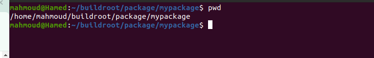
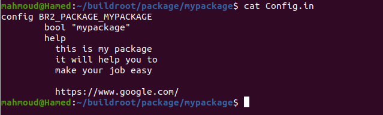
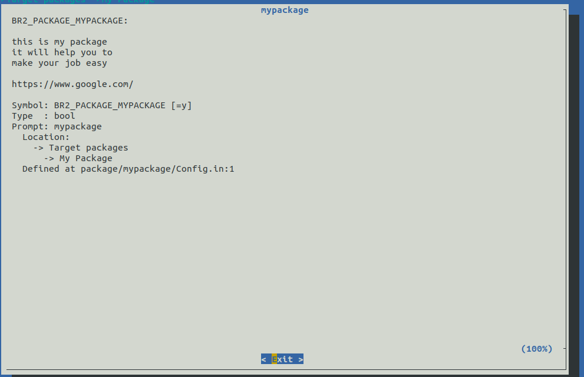
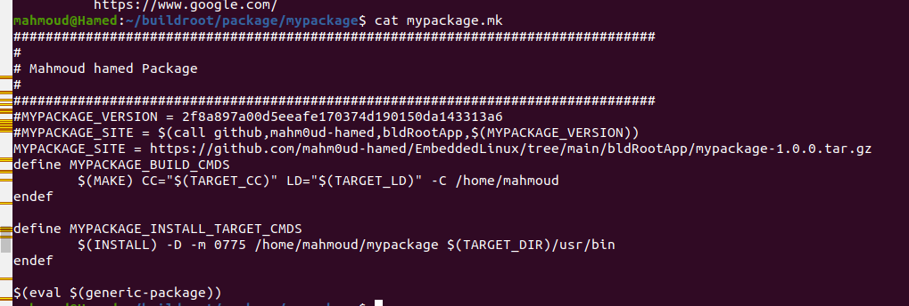
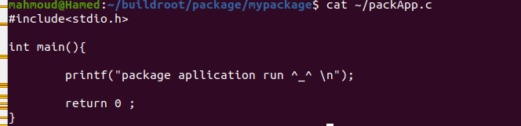
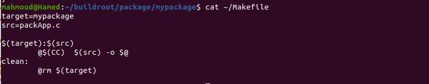
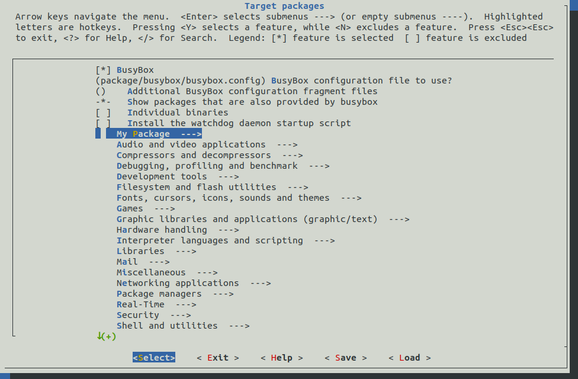
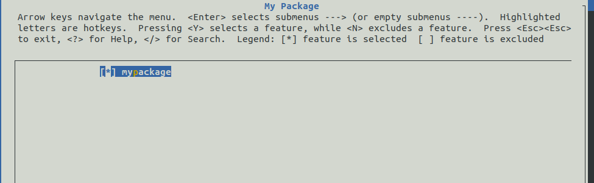
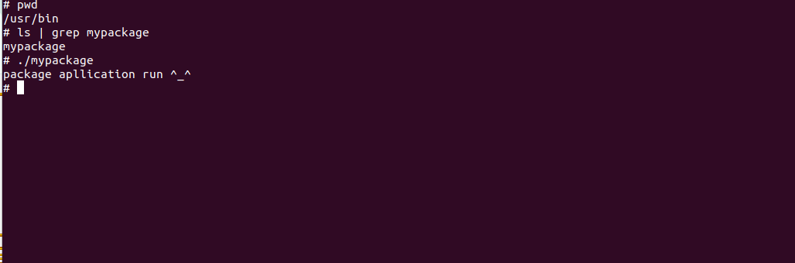

# adding package to build root and insert it to generated image 

## why we need to add package to build root ? 

Adding packages to Buildroot is essential for tailoring the embedded Linux system to include the specific software and libraries required for your application. Here's why you would need to add a package to Buildroot : 

1. Customizing the Root Filesystem
Include Necessary Software: You might need specific libraries, tools, or applications that are not included by default in the minimal root filesystem created by Buildroot. Adding packages ensures that all required software is present on the target system.

for this purpose we make our application 

## on host steps for creating package 

1. under ~/buildroot/package add directory for your package 

2. under ~/buildroot/package/mypackage/ create Config.in file 

The bool line, help line and other metadata information about the configuration option must be indented with one tab. The help text itself should be indented with one tab and two spaces, lines should be wrapped to fit 72 columns, where tab counts for 8, so 62 characters in the text itself. The help text must mention the upstream URL of the project after an empty line

bool : Purpose: The bool keyword defines a Boolean configuration option. It allows the user to enable or disable a specific feature, package, or setting within Buildroot.

indicates that this configuration option is a simple on/off switch. If the user enables this option, the package mypackage  will be included in the build; if disabled, it won't be included.

When using the menuconfig interface, this option will appear as a checkbox labeled "mypackage". The user can select or deselect this option, determining whether the libfoo package is included in the build

help: keyword introduces a section that provides descriptive text about the configuration option. This text is shown when a user selects the option in the menuconfig interface and presses the ? 

3. under ~/buildroot/package/mypackage/ create .mk file 

what is the purpose of .mk file 

Finally, here’s the hardest part. Create a file named mypackage.mk. It describes how the package should be downloaded, configured, built, installed, etc.

MYPACKAGE_VERSION : is a variable carry the version og package or it can carry the commit shaone hash for the commit to access specific commit 
it used whrn get package from git 

MYPACKAGE_SITE = This line sets the download location of the package source code to a specific URL. This points to a .tar.gz file, which is an archive containing the package's source code. Buildroot will use this URL to download the package during the build process.

define MAYPACKAGE_BUILD_CMDS : This block defines the commands to build the package.

$(MAKE) invokes the make command.

CC="$(TARGET_CC)" and LD="$(TARGET_LD)" are setting the compiler and linker to be used, which are configured for cross-compiling for the target architecture.

-C /home/mahmoud tells make to change to the /home/mahmoud directory before running the build commands.

The build commands are placed between define and endef and will be executed during the build process.

define MYPACKAGE_INSTALL_TARGET_CMDS : This block defines the commands to install the package into the target root filesystem.

$(INSTALL) is a command used to copy files and set permissions.
-D tells install to create any necessary directories.

-m 0775 sets the permissions of the file to be rwxrwxr-x.

/home/mahmoud/mypackage is the source file or directory being installed.

$(TARGET_DIR)/usr/bin is the destination directory in the target filesystem where the package will be installed.

$(eval $(generic-package)): This line tells Buildroot to process the package using the generic package infrastructure. This line evaluates the package description, integrating it into the Buildroot build system. It handles the downloading, extracting, building, and installing of the package using the commands and settings defined earlier. 

4. create APLLICATION needed to include in image 

5. create make file that .nk file will use it to build our application 

6. now selecting package from menuconfig to be integrated with build 

7. Build Image 

## on target 

1. run image in target 

2. run aplication in target 

