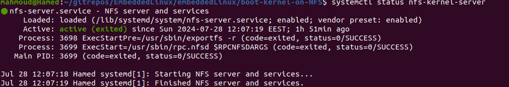
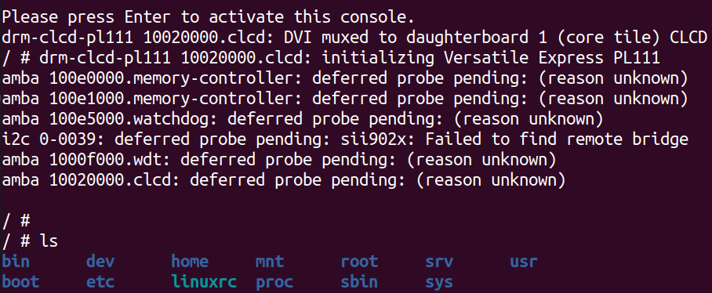
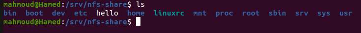
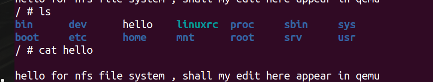

# mounitng root file sysytem using NFS 

## advantages 
It gives you access to the almost unlimited storage on
your host machine, so you can add in debug tools and executables with large symbol tables.
As an added bonus, updates made to the root filesystem on the development machine are
made available on the target immediately. You can also access all the target's log files from
the host.

1. ## begin  install nfs kernel server 
```bash 
sudo apt install nfs-kernel-server 
```
   ### check if nfs is installed corect 
```bash 
    systemctl status nfs-kernel-server
```


After installation, the NFS server configuration is stored in the /etc/exports file. This file will contain the exported directories which will be stored in the server (rootfs directory). In the beginning there is not exported directories. You can view NFS configuration file :
### now we need to inform NFS which directory will exporetd to the network  
```bash 
cd /etc
cat /etc/exports 

/srv/nfs-share *(rw,sync,no_subtree_check,no_root_squash)
```
* "*" exports the directory to any address on my local network
it can be repalced by an ip address 

* rw: This exports the directory as read-write.

* sync: This option selects the synchronous version of the NFS protocol, which is
more robust but a little slower than the async option.

* no_subtree_check: This option disables subtree checking, which has mild
security implications, but can improve reliability in some circumstances

* no_root_squash: This option allows requests from user ID 0 to be processed
without squashing to a different user ID. It is necessary to allow the target to
correctly access the files owned by root.

2. ## The NFS server needs to be told which directories are being exported to the network
### for arrniging need i will ceat directory under /srv/
```bash 
cd /srv 
mkdir nfs-share
```
## copy rootfs for the directory will loaded in server 
```bash 
sudo cp -rp ~/rootfs/* /srv/nfs-share/
```
### copy zImage and .dtb file in /sr/tftp 
## statrting qemu with tftp to laod zimage and .dtb file in RAM 
```bash 
sudo qemu-system-arm -M vexpress-a9 -m 128M -nographic -kernel ./quboot/u-boot -sd ~/gitrepos/EmbeddedLinux/manulecustomization/sd.img -net tap,script=./quboot/qemu-ifup -net nic 
``` 

## in qemu side  
1. ### set environment variables for host ip addresss 
```bash 
setenv serverip  192.168.1.10 # copy this ip form qemu-ifup script  "this is ths host ip "
setenv ipaddr 192.168.1.13    # "this is ths host ip "
``` 
## load zImage and .dtb file in RAM 
```bash 
tftp ${kernel_addr_r} zImage 
tftp ${fdt_addr_r}   vexpress-v2p-ca9.dtb
``` 

## seting bootargs to boot through server 
```bash 
setenv bootargs 'console=ttyAMA0  root=/dev/nfs ip=192.168.1.13 :::::eth0 nfsroot=1192.168.1.10:/srv/nfs-share,nfsvers=3,tcp rw init=/sbin/init'
``` 
## start booting for kernel 
```bash 
bootz ${kernel_addr_r} - ${fdt_addr_r}
```

### now kernel panic gone also my panic 


any file created in /srv/nfs-shared will append on qemu 




