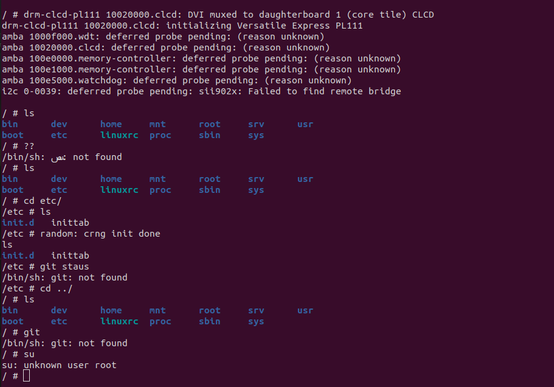

# booting kernel on initramdisk 
## what is the initramfs 
An initial RAM filesystem, or initramfs, is a compressed cpio archive. cpio is an old
Unix archive format, similar to TAR and ZIP but easier to decode and so requiring less
code in the kernel. You need to configure your kernel with CONFIG_BLK_DEV_INITRD
to support initramfs

## creating standalone intramfs 
The following sequence of instructions creates the archive, compresses it, and adds a
U-Boot header ready for loading onto the target:
```bash 
$ cd ~/rootfs
$ find . | cpio -H newc -ov --owner root:root >
../initramfs.cpio 
cd .. 
gzip initramfs.cpio # compress the cpio archieved file wit gzip 

$ mkimage -A arm -O linux -T ramdisk -d initramfs.cpio.gz
uRamdisk #mkimage will make uRamdisk excutable fot target ram one source it in uboot 
```
* cpio -> . cpio is an old
Unix archive format, similar to TAR and ZIP but easier to decode and so requiring less
code in the kernel

* --owner root:root -> give owner ship on files for the rootfile 
* initramfs.cpio -> the output file of compression operation 

* uRamdisk -> output file from mkimage command 

## copy uramdisk int boot partition in sd card 
```bash 
sudo cp uRamdisk ~/andorid\ automotive/githubrepos/EmbeddedLinux/manulecustomization/sdcard
```

## Run qemu
```bash 
cd ~ 
sudo qemu-system-arm -M vexpress-a9 -m 128M -nographic -kernel ./quboot/u-boot -sd ~/gitrepos/EmbeddedLinux/manulecustomization/sd.img
```

## configure bootargs on qemu 
```bash 
setenv bootargs console=ttAMA0 rdinit=/bin/sh 
``` 
## storing uRamdisk in RAM 
```bash 
# creating variable that will store uRamdisk in RAM 
setenv initramfs 0x61000000

#load uRamdisk on this loaction un RAM 
fatload mmc 0:1 ${initramfs} uRamdisk 
``` 
## loading kernel  and dtb file in RAM
```bash 
#loading kernel 
fatload mmc 0:1 ${kernel_addr_r} zImage 
# loading dtb 
fatload mmc 0:1 ${fdt_addr_r } vexpress-v2p-ca9.dtb
```

## booting Kernel in initRAMdisk 
```bash
boot ${kernel_addr_r} ${initramfs} ${fdt_addr_r }
```
# againg kernel panic gone and my panic 



