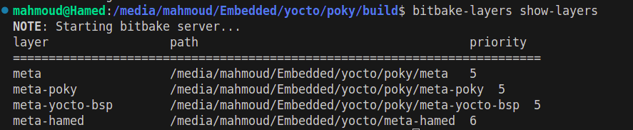
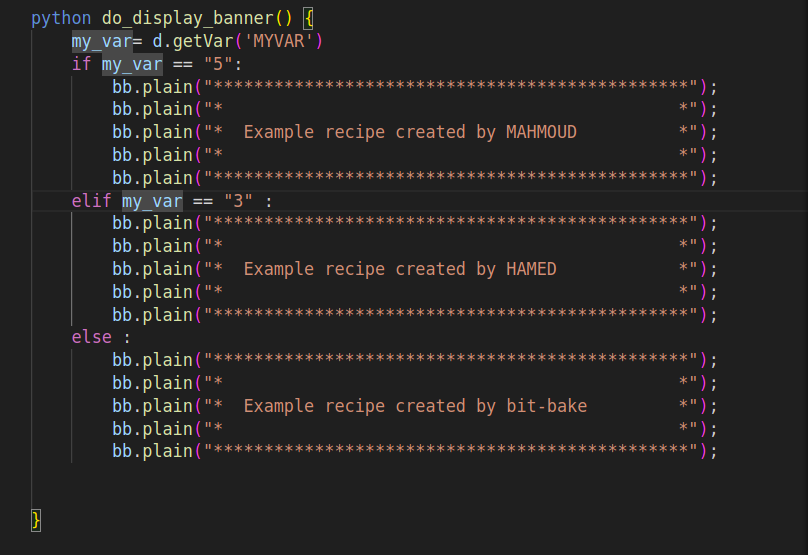
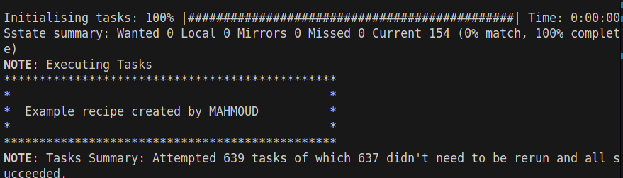

# Yocot customize layer 

## to customize layer at first we need to create our layer 
- this will done using :
``` bash 
bitbake-layers create-layer [path]/meta-layename
``` 
**when we use this command it will not run beacuse the environment is not stted , so we need to set environmet this will done using :**
```bash 
source oe-init-build-env 
``` 
after runnig this command the environment will be ready like bitbake binaries will added to PATH to run it from any place in machine 

**now we are ready to create layer** 
- be care layer name must contain meta-name
``` bash 
bitbake-layers create-layer meta-hamed 
``` 


**after create laye we need to add it to **bblayer** file**
- this file contain all pathes of layers to use it in conf files to reach to the recipes .bb and .bbapend files 
**adding layer to BBFILE file we will use this bitbake command**
```bash
bitbake-layers add-layer 
``` 
**to sure that layer added to BBLAYER sucess we will use this commanad 
```bash 
bitbake-layers show-layers 
```
- this will be the output

 

**after create layer we will add a global variable to use it in task** 
- global variable created in any file with extension .conf 

```bash 
# move to layer directory 
cd meta-hamed/  
cd conf/
``` 
- layer conf contain the layer contain layer.conf file 
```bash 
vim layer.conf
``` 
- adding global variable is done in this way 
```bash 
MYVAR="3"
```
**after create global variable we need to use it in our recipe to peroform task**
- what is recipe? 
- - defines how to build a software package. It contains instructions, dependencies, and metadata that tell the build system how to fetch, configure, compile, and install the software. Recipes typically have the .bb file extension and are written in BitBake language

```bash 
cd recipe-example/ 
cd example/ 
vim example_0.1.bb 
```
**task is to read the variable and depend on its value we will print banner in differnt way**
- how to read variable in python do_display (){} ? 
  - using d.getVar('MYVAR')
```pyhton 
my_var = d.getVar(MYVAR)
```




**after adding this part of code to recipe we need to run recipe using bibake**
- this done using this bibake command : 
```bash 
#bitbake "recipe-name"
bitbake example 
```
**output**


