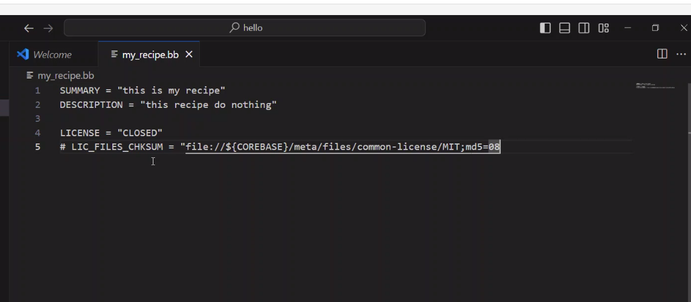

### open embedded community 
bit bake is a build tool that take configuration and make some clonning and it generate a Image 

1. configration is some meta data 

## steps 
1. mkdir imageGenerat 
2. /imageGenerat/ git clone bitbake ->clonnig tool from gir repo 
3. git clone apllication layer
4. git clone board suppot pakcage -> at least you need on layer for your board 

## to create image you need some medat data (layers)

there is two type of layers 
1. application layer -> run in user space 
2. board support layer -> run  hardware space 

community create -> layers  which contaian applications -> if you need some application in your target you will clone layer that contain this application    

community create -> layers  which contain board support package -> its name was for example "meta rasspberypi"

if you need to wrok on board rsspberi pi you have to clone  meta rasspberypi"

## open embedded problems 
1. compatiblity -> peoble can make updates in meata layers which is compitable with specific bitbake when user clone this metalayer and bitbake he will founad that this metalyer is not compatible with this bitbake 

# YOCTO 
create reference of usage of open embdedd and bitbake 
its a concept of how to create image 

yocto create layers for its own 
1. meta poky  -> application layer 
2. meta yocto-board-support-package  -> hard ware layer 
## yoto git repo contain
1. meta poky  -> application layer 
2. meta yocto-board-support-package  -> hard ware layer  

3. the most important layes in open embedded 
    1. meta core 
    2. meta sciliton  -> template how to crate Board support package 
    3. bitbake -> build engine 


## how yocto solve open embedded problem 
make poky as git brancehs which contain bitbake and metalayer -> when any one make any update in meta layers he notice that this meta layer compatible with this bitbake version 
### how to chose branch to work with 
1. it debend on your meta layer and its comitability with bitnake version 
2. it support long term support 

user who create meata data 
### meta data content 
## contain layer which is contain 
1. bitbake need user configuration wich is .conf extension 
2. application  any thing with extension .bb 
3. calsses  any thing with .class 
4. bbappend -> is an include file for .bb 
5. .inc -> is a include file 

## layer types  
1. APP -> contain .bb extension and bbappend 
2. meta.bsp -> contain .conf 

# 1. user configuration is parted for 2 parts 
1. distro -> name of output  distribution 
2. BSp -> board support package 


### bitbake work steps 
1. clone application in (downlaod) directory 
2. unpack in  (s) directory   // s stand for source e
3. patch in   (s) directory
4. configure application  
5. build application in (B) directory  // B stand for Build 
6. install -> select the place of excutable file under root file system in (D) directory  // D stand for directory 
7. package feeder 
    1. SDK -> if you need to debug in application will generate application  with debug sympols  (in development phase )
    2. Image -> if you need to generate application without debugging sympol (production phase )
 
## ".bb file" contain (recipes ) all steps that bitbake run to generate your application 
there is a parsing for the .bb file to parse synatx of.bb to check if it follow bitbake syntax . 
--------------------------------------------------------------------------------------------------
### yocto documentation 

# variables 
in general 
there is two type of variables 
1. local 
    under any file with this exension 
    1. .bb
    2. .bbappend 
    3. .class 
2. global // global on metadata serach on all files .conf any file in meta data will see this gobal variable 
    1. .confg 

## how to assign varable 
myvar="string"
variables alwys string no arthematic operation . 

## how to read global variable 
    bit bake tool 
    bitbake/bin/bitbake-getvar var_name will return value of global varable. 
   
## variable assignation 
1. normal assignation 
    var = "3" 
    var = "4"
    bit bake value be  4 
2. week assignation 

    var="3"

    var?="4"

    bitbake will see that var = "3" and 4 is considered as weak assignation 

    /******************/ 

    var?= "3"

    var?= "4"

    bitbake value will be 3 variable will be assigned to 3 and will ignore 
    4 as considered as week assignation 

3. week week assignation "??"

    var??=4

    var ? = 3 

    bit bake result wll be 3 -> week week will not assigned to varable only when not find any stronger assignation will assign week week  

    /***********/ 

    var??=4 

    var??=3

    bitbake value will be 3
      
    /***********/

    myvar??="4"

    myvar?= "5"

    myavr = "3"

    bitbake value will be 3 

4. appending

    if var="4"

    var+="4"

    bitbake value = 4' '5 -> will add space between two  values implicitly 

    /*********/ 

    if var = "5" 

    var:append="4" 

    bitbake value 54 -> no space between two values 

    /***********/ 

    val ="4" 

    var +="3" 

    var:append="6" 

    bitbake value 4 36 

    if val ="4" 

    var:append="6" 

    var +="3" 

    bitbake value 4 36 -> this because alphapitical assignation will be the 
    lowest prioriy in assignination -append is better than += 
    
    /**********************/

     val ??="4" 

    var:append="6" 

    bitbake value will be  6 

    val ?=5

    val += 6 

    bitbake value  5 6 

    var ?=5

    var +=6 

    var  =7 
    bitbake value = 7  

    var ?=5

    var +=6 

    var ?=7

    bitbake value 5 6  

5. imediate assignation 

    /** not imediate**/ 

    xar= "3"

    var="${xar}" 
    
    -> var = 3 -> $ inimediate assignation  make  it not  assign to value until xar not modeified any more 

    xar="4"  -> xar =4 var =4 

    /** imediate assignation **/ 

    xar= "3"

    var:="${xar}" 
    
    -> var = 3 bcouse of imediate assignation will see the 
    
    perviouse value and assign to it
   
    xar="4" 

     /*************/ 
    
    var="${xar}"
    
    xar=5 -> var = 5 and xar = 5 in imediate and unimediate assignation 
    
    /****/
    
    XAR ??="3" 

    var="${XAR}" 

    XAR ?? = "4" 

    var -> will be 4 as this is not imediate assignation and it is ot fetched in sequential way 

        
    / *************** /
    
    XAR ??="3" 

    var:="${XAR}" 

    XAR ?? = "4" 

    var -> will be 3 as this is not imediate assignation and it is ot fetched in sequential way 

6. append and preappend 

    .= append ->  
   
    =. -> dosent include space 

    priotity of appending  

    1. += if the hihgest priority 
    
    2. .= the second priority 
    
    3. :append= the lowest priority beacause alphabitiocal alyes the lowiest priority 

    

7. remove 
    
    var = "3 5 6 "
    
    var :remove="5"
    
    bitbake value will be "3 6 "

    if you create a variable  in (.conf) file  all meta data can see it -> 
    .bb .class .bbappend .conf files can see it 


##  local variable 

1. S carry directory  ->

2. B carry directory 

3. D carry directory  in recipe 

## to create recipe
-> never use any layer from  open embedded layers -> becouse any meta you git it from repo but if you edit on it you will destroy structure 
    never edit on poky layers 
    never edit on thirdparty layer

    - create layer outside of poky and anything related to 
      openembedded 
    
    - third party layer 

1. create layer 

bitbake give you a command to create a layer 

- "bitbake-layers create layer [path/meta-name]" 

-> this will create a template for layer 

- meta is mandatory in layer name 

- conf -> it has all .conf files 

- conf/layer.conf -> all description of layer  like LAYERIES_COMPAT_meta-name compatible version of poky 

LAYERDEPENDS_meta-name -> layer depend on another layer 


 
* recipe is a regular file not excutable 

2. add your layer in BBLAYER.conf 

    there is only one file BBLAYER.conf 
     
- how to show layers 
bitbake-layers show-layers 

important of this file

    include all layers that you want i your building system  by  adding  your path of layer usig this command 

    1. vim bblayer.conf and your layer 
        never use any relative path 

    2. bitnake-layers add-layer 

    when you add alayer make sure that you are in your build environment directory /* you can add using relative path */

- when adding layers to layers toBBLAYER.conf and this layer depend on another layer is not exitt bibake will genrate error that this layer is not exisit and will not add layer to BBLAYER.conf 

- when you add layer make sure taht you are in poky/build environment 

3. run bitbake in your recipe 
    bitbake recipename 

- one of the important script to build your environment 
    source oe-init-build-env 

   -  create your environment 
   -  sourcing this file will add the bin directory of bitbake to PATH environment to run bitbake as normal command 
   -  create tempaltes of the build environment crate build directory and its conf dorectory inside build directory 

## how to run recipe 
- bitbake recipe-name 
    this command will pares conf file to kow ho to locate your recipes 

### task
    ceate an environment 
    create layer 

## rercipes hyrolicy addition 

how to find your recipe inside your layer 


# yocto seesion 2nd online session 

## how to write recipe 


- **LICIENSE :** i a local variable contian liciencse of recipe 

- **LIC_FILES_CHKSUM :** i local vaiable contin calculating check sum of LICENSE  files 

**you can find licence  in -> poky/meta/files/common-license**
all licines you nedd to write a recipe 



## how to calculate checksum 
- **md5sum:**  this is a linux command to calculate its checksum 
```bash 
md5sum MIT
#outout was a number  input liciense name 
``` 
LIC_FILES_CHKSUM=" <schema> // [location of file ]; md5=hash "output of command md5sum MIT " 

## what is schema 
1. file locally -> on your machine -> "file://"
2. file in github -> ssh , http clonning -> "git://" 
3. file in http server -> wget -> "htpp://"

how to set MIT location 
"file://$(COREBASE)/meta/file/commom-licence/MIT;md5='check sum value'"


## SRC_URI  local variable 

- is a variable responsiole for clonning file from repo and downlaod it in DL download directory whic is fetching operation 
which is nedded for unpack process which is done in S directory done by bitbake 

- in local source files src_URI impact will find source file and put it in WORKDIR to comple from workdir 


- **fetching or locate source files form github**
    - SRC-URI="git://github.com/mahm0ud-hamed/EmbeddedLinux.git,protocol=HTTPS,branch=main"

```python
    do-fecth{

    }
    # will copy data from SRC_URI in WORKDIR 
```


- **form local** 
    - SRC-URI="file://main.c" 
    searching for main.c it should be located "locate source file" in special place in expand you will find a variable "FILESPATH" contain search directories 

- **how to add new directory for srearching** 

    - to add new directory for serarchong process 
    in ..bb file append path in FILESPATH
    FILESAPATH:append=" :${THISDIR}/newdirec: "

    bitbake will search for main.c in file path and copy it to workdir 
    so when you need to compile , compile form working directory 


## SRCREV variable used for github
- used for github only to check out for specific hash commit 

- SRCREV="commit sha one hash"


### there is another local variables hidden in each recipe

- **PV** -> package version 
- **PR** -> package release 
- **PN** -> package name 

**how to name recipe?**

- **exmple: myrecipe_2.0_r3.bb**

- **myrecipre** package name
- **2.0** package version 
- **-r3** package release 
 no need to set hidden variable it setted by default form recipe name 

- **S**-> source directory of the recipe (unpack) 
 
- **D**-> destiation directory used by package feeder 
- **B**  -> build directory "used for compile"

 ## How to know value of loacal variable 

```bash
 bitbake -e recipe | grep variable_name 
 ```
 - **-e** -> expand 
   
 

 generate python script which will get run by bit bake  


 bitbake take a .bb file and output was package excutable on the target machine 

 ## WORKDIR -> top directory of recipe that contain S ,D ,B directoreis 

## THISDIR -> containg Path of recipe directory 

 ## comand to clean recipe build
- bitbake -c cleanall name_of_recioe 

- **how to compile in recipe**
```python
do_compile{
    ${CC}{CFLAGS} ${WORKDIR}/main.c -o ${B}/myapp
    #cmopile main .c and output in build directory with name myapp 
}
```
this function will override function exist in expand file 
any edit you need to make will be in .bb file and this edit will expand in expand file 
- **how to list all tasks in myrecipe**
    - bitbake -c listtasks recipename

do_install(){

    # move output of do compile to image directory 
        mkdir -p ${D}/usr/bin 
        or
        mkdir -p ${D}/${bindir} 

        or 
        cp ${B}/myapp ${D}/usr/bin
}


bitbake.conf 
contain global variables and its value will be local for each bb file
and it value change from bb file to another and will atake a default value for every locally in bb file 

never edit in global variable in bibake.conf cause this edit will be edited in all recipes and this will generate confilict 
if nedded make append not assignation 


----------------------------------------------------------------------------


- **how to run specific task**
    - bibake -c tasknme_without_do recipe_name 

## Documentation.conf file 
- is a file in poky/meta/conf , which conatain a descripion for all varables and tasks in yocto 

## bitbake.conf file
- is a file in poky/meta/conf  statrndr target for file system path 


- **alll global variable may you use is palced in :**
    - local.conf 
    - Distro.conf 
    - layer.conf 
    
    **never edit any  variable form this file  in your recipe  because it will impact in  alll recipes , you need to append on the variable** 

## do configure 

do configure{
    it is a task to make some configuration before bulding
}

check how make file are used in yocto 

# yocto session 3rd online session 

1. recipe 
    a. header section 

        SUMMARRY 

        DOCUMENT 

        LICIENCE  

        LIC_FILES_CHKSUM -> file,md5="sha one hash"
    
    b. Development 

        do-fetch

        SRC_URI was called by do-fetch task and it ended in  download folder "DL"

        SRCREV= to fetch from github "commit hash"

        do unpack -> workdir 

        do-patch 

        do-configure 

        do-compile 

        do-install 

        all this list was task and it has a default impelementation 
        when you impelement any one og this tasks  it will overwrite default of this task 

        ptyhon do-configure{

            python code // python commands 
        }

        do-configure{

            shell  command  // python commands 
        }

- all variable in yocto globaal but differ in 

    - if it has direct assignation it was a true global variable 
    - if it assigned to script , this mean that its value will be changed from recipe to another , 

-**how to read value of local variable ??**
```bash 
bitbake-getvar -r recipeName variableName 
```

## documentation.conf file 

- it a very important file it will help you to know all variable meanining 

- you can find it on 

- /home/mahmoud/Embedded/poky/meta/conf/documentation.conf

## local.conf file 

- MACHINE=" machine name" you pass the machine you buile recipe for it 
you get the name of machine 

- you can  get it from layer

    - meta/conf/machine  

- machine.conf file 

    layer/machinedir/machine.conf 

    - machine.conf will pas to MACHINE variable in layer.conf  

- **BSB layer** 


- **defrience between pakcage layer and board support package**


- DL_DRI = directory where fetch done 

- SSTATE-DIR = related to cahshes -> store status of tasks completed becasue if you build agin will not run task again 


- TMPDIR= /work/working directory for all recipes 
        /deploy/ image that you will dd in your sdcard 

- DISTRO= represent the name of your distribution, once you change distro name  , under your layer you need to create distro_name.conf

    - layer/conf/distro/distroName.conf


// :1:38 -. in recored 


waht is the difference between distribution to another one ? 

1- package manager 

2- libraries 

3- init process 

4- Kernel version 

5- uboot version 

PACKAGE_CLASS =

- package-rpm -> tmp/deploy/rpm -> conatain all package that you downlaoded 

- you can pass it to your firend who use same package and same machine 
    - why same machine 
        package inside rmp is compiled already son it compiled for specific taregt 


- PATCHRESOLVE= if it assigned "noop" errors will dsipalyed on terminal if it set as "user" will open a terminal to solve errors 


BB_DISKMON_DIR = monitor computer sapce if it low yocto will stop to save your data in pc 
 
## .bbappend  files is atype of meta data 

extend functionality of the main recipe 

if you have a recipe written by some one and you need to edit on it you will use recipe.bbappend '


it must 

1. with same name 

2. same version 

ahmed-%.bbappend -> % will map to the latest version of the recipe 

if there is many recipe with same name and it was with different version was includded in BBLAYER the latest version will used when use % 

if they with the same name and same version the higher priority will be taken 

if you need to use any functionality from old recipe will user :appedn 

do_install:append(){

    //your extra code 
}

if you use without append it will overwrie old recipe finctionality or variable 


## .bbclass file 

- make a functionality on background that you not need to implement it by yourself it may need to run before your recipe start this done on target 


- inehrit will work with bbclass and any thing you  inherit  it you have to know that this is a bbcalss 

- inherite any thing in .conf file will be inherite over all project , if you inherite in recipe this ihheritance will be over recipe only 

- Yocto create his environment and downlaod its dependecies wil not depend on what exist on your host machine b 

- when you inherit cmake it will downlaoded and fetched and be ready to use in yocto 


- your application will be under destination and pcakage feedr will put it rootfs 

- **IMAGE_INSTALL**= variable contain recipes that you need to add it to your file system 


Task 

1. create an rasperipi image 
    ceate layer 
        cleate conf/distro/almaza.conf 
        creaye recipe 
        ping on ip of your pc
            if it can ping led off 
            if it cant oing led onn 

distro = almaza.conf 

# yocto session 4th online 15-8 


for example image for RPI 

- meta -layer
- addlayer 
- conf/machine -> board conf get name of machine that you need image for it 
- local.conf -> meta-raspberypi machine 

- bitbake core-image -minimal -> generate inamge 

- Distro.conf file you can define : 

    - kernale version 
    - uboot version 
    - library 
    - init process 
    - package manager 

**bitbkake flow of work** 
- fetch -> unpack -> configure -> build -> install "int D directory"
    - after bitbake finish installation that dosent mean that application you build using bit bake is inserted in rootfs of generated image it just installed in destination directory 

- **intgerate new application in (rootfs)** 
 how to integrate buit application in rootfs , bitbake provide an variable 

- **IMAGE_INSTALL:append=" recipe"** package feeder will copy your application in rootfs
- this variable you wiill apppend all recipes that you need  to be in image rootfile system " you append for this variable not overwrite it "

- this varable is used by core-image-minimal 
- **meta-layer** 
    - recipe-bsb 
    - recipe-core 
    - recipe-image
        - core-image-minimal 
        after making your image recipe you need to inherite image.bbclass in your recipe to talk to image feeder and this is for help in build your root file system 
    - conf
        - distro
            -distro.conf 


- **bbclass**
    - is not a recipe is a helper it seems like some tasks need to run in many recipes ,  kernel.bbcalss -> module.bbclass you can inherite to build kerenl module to build it for kernel  

    


- **meta-skeleton  its created by open embedded cotain examples to generate kernel module**


SRC_URI="file://" search in FILESPATH variable to find your application and it is not professional to edit on it so the you will do in FILESEXTRAPATH 


- **patch**
    - suppose you have a file and in some palce in file you write that loadinf address in 0x3000 and this file is written for beaglebond and you need to use this file for rasspberypi with loading address 0x2000 so instead of you edit it manuelly because  it has some problem that you edit in original  file , so after change and you need to keep the original  file as its , make a git diff on file edited and redirect output in a file.patch , and then reset the main file to it original state ,a fter this when you make a git apply patch on the original file and this will add the difference 

    - in yocto this will be done as 
    ```yocto 
    SRC_URI="file://main.c
            file://mypatch.patch"
    ``` 
    and this will done if do_patch task , the yocto link the two files because in patch file the original file path is written


git diff filename > file.patch //.pathc is must 

git apply patchfile 


-**in yocto** 
SRC_URI="file://main.c 
        file:://file.patch "


- **PROVIDE , DEPENDS** 
- DEPENDS -> list recipe depends in **build time** 
             if your application depend in a library not exist build will not complete 

             recipe-add.bb - output >  libadd.a 
             recipe-calculator.bb - output > calc.exe 

             recipe calculator depend in another recipe wich is add.bb so in recipe-calculator.bb we need to add DEPENDS="recipe-add" 
             this recipe will run before recipe-caclulator and output will copied to WDIR to use it in buildd of calc.bb 

- PROVIDES -> if any recipe depend on this recipe PROVIDE wiil change the depend name to be more redable by the programmmer to be more logical 
    eg : 
        recipe-add 
        PROVIDE="libadd"

        recipe-calc 
        DEPENDS="libadd" instead of DEPENDS="recipe-add"
    

## runtime dependencies 

- RDEPEDNS -> is a depend on recipe in run time like if you need python in your image without add it in Image install varaible , RPROVIDE will add pyhton to your rootfs to be used in machine run 

- RPROVIDES has a feture over IIMAGE_INSTALL  for example if you add python in image install , python will be added in roootfs if you have any application in rootfs need python or not , but if you used rdepend with application recipes need python , then if you have n application need python in your rootfs , puthon will not includded in your file system 

- RDEPEND -> depend on RPROVIDER 


## system D 
- yocto by default is a systev init process 

- system d is a distro feature 

- DISTRO_FEATURES -> enable feature for Distribution like if you need to make your init process a systemD init process 
    in distro.conf because make an init process systemd init processs is a feature related to distro so you need to add it in distro.conf 
        - DISTRO_FEATURES:append= "systemd"
        until this line the image will init on system v so how to switch to system d init process 

        change the value of init manager to systemd 
        


INHERIT="rem_work" after build ti will remove source files and it was a choiceable to depend if you need source files or not 


# yocto session 5 ofline 

## SDK 
- bibake -c  core-image-minimal listtasks 

will list collection of tasks 
- implicitly run task 
    - do compile 
    - do fetch 
    - do install
- explicitly runtasks **this tasks for generate sdk** 
    - do -populate-sdk 
    - do-populate-sdk-ext 

- to run task explicitly 
    - bitbake -c core-image-minimal populate-sdk 

**why it take long time ? 
- it take long time because it keep debug table in output binary 
- generate an environment for specific processor if you compile any application in x86 machine will compile for the target processor by changing hthe path of user/bin to the bin under the workdir in yocto build directory this can apply for java and Qt ti make development more easier and quicker 


- **how to run SKD 
    - bitbake  core-image-minimal -c listtasks 
    - bitbake core-image-minimal -c populate sdk 
    -  how to go in this environment -> cd build/tmp/deploy/sdk 
    - run script and give it th


## devtools 

- it automate recipe writting 
- deploy 

- how it work 
sourec oe-intit 

- devtools create-recipe "github link up stream " "recipename "

- devtool layer -> create under build directory "Workspace" and add it for BBlayer
    - workspace act as a layer and add recipes on it 

- devtool deploy "recipename"
    - instead of using SCP comand , devtool deploy will compile it and send it to machine 
    - it know location of sending in target form recipe if your application in under usr/bin in recipe will send it to this location in target 

    
**we can use RDEPEND for inserting jvm in Image** 

**search for scp communication** 


# device drivers

- is a standr way to write derivers using kernel headers which is use struct as data structure 
- use c to be as oop by design 

## ways of writting device drivers 
- character  use device.h 
- newtwork 
- Block 


- linux is partioned to 
    - user space 
    - kernel space 

- kernle create a device node unde /dev 

- kernle if you need to ingect characted device in kernel kernel will give it an id "device number" to access this driver  which also named as node id 

- deviec numer are partioned to 
    - major  
    - mainor

    - if you have a device like ttl it exsit 4 times this mean that mainor is 4 and major is 1 because the four ttl perform same functionality so it represented as one device and exist 4 times 

- to allocate chracted device in kerenel will use 
    alloc_chrdev_region( dev-t dev )

- dev-t is data type 
    dev is the variabel will filled with the id which is minor and major number 

- baseminor  starting count of minor 

- count number of minor devices 

- char * name -> device name 

-**how to know major and minor numbers of devices**
    - printk(%d,Major(device-number))
    - printk(%d , minor(device-number))

- after alloc function the device is allocated in kernel and you have no way to access this decvice nothing will appepar in user space 
- by making demsg you will get the device major and minor 


- to add it in user space 
    - mknode -c 47 3 /dev/mydevice 
        - mydevice is the channel to access this device in kernel , this is the node
        - each node is can  point to one minor device  


-**file operation** 
- system call is handler will call back in kernel

- our file operation is in  struct file operation {
    .write = cbfunction of write 
    .read  = cbfunction of read 
    .open 
    ..  
}

- **how to assign this call back function to this chracter device**
    - cdev-init(cdev* cdev , const file operation *fops ) it will copy the address of file operation structure to the file operatiion pointer in cdev struct 
    - cdev* cdev is a pointer to struct is the data structure will be on the c dev in ram like filesystem in sd card 

- **partial conclusion**
   - devt-t devicenumber  ->  major and minor  
   - struct file operation -> developer will impelement all callback 
   - struct cdev -> allocate raw memory in ram 
   - alloc-chardev-region() -> alloc gfree memory in ram to be initialized as charcted device 

   - cdde -inint () -> initialize cdev datat structor 
        - file operation 
    cdev-add (cdev , device+i , 1) ->


    **difference betwwen sys ans dev** 
    - sys is to create attributes to partion minor to every   
    

    - **impelemntaion of call back**

    ```c 
    ssize_t myWrite(file , buffer , size ){

        // buffer cintain data that the user is write using for example echo or vim 
        // u can't use buffer address directly because this address is paged this is the virtual address so u need to remove paging from this address so you need to use 
        copy-from-user(); // this function will take buffer to retrive data from phyiscal memory 

        //to access gpio pin for 
        gpio_setPin( physicaladdress , std-high)
    } 
    ```

- **impelement charcterdevice  initfunction**
```c 
    initfunction(){
    allocate-chrdevregion()
    cdev-inint()
    cdevc-add()
    calssCreate() // create new device under sys/class/device
    DeviceCreate() // add info about device in sys/class/device -> this info is major and minor number 
    }
```
- class create and device create use udev service 
    - udev 
        - is a software in userspace read the /sys/class/device and parse major and minor number and then make node for device under /dev in this service istead of mknode  that user must write it to insert device under /dev automatically 


## platform Driver , platform bus , PCI 

### PCI 
- is a hardware bus exist in machine like PC , it automatically detect new HW conneced to machine 

## platform bus 
- cant detect HW injected automatically
    - exmaple for platform bus in arm cortex (AHB , ABB) 


## platfrom Deriver 
- not detectable but 
- user write a sw and inject it using "insmod" and then it was detected 

``` 
- you have a gpio can run lcd and led and switch

- gpio is the driver major

- and lcd , led and switch is devices use driver -> minors 

to make gpio detect that there is a led is conneted to gpio you need to write a piece of code 

and it contain a matching table that it was a struct { lcd-123, led , switch } this is  in driveer 

in device you will name as led or lcd or switch 

1- insert driver insmod driver and it will listen for device 

2- in device.c 
    give yourself name as lcd-123 once you inject this device in kernel , kernel search for deriver who can run this device and in deriver.c you need prop function that will set gpio directions and make needed intialization 


    full operation : 

    deriver.c has a matching table which is contain and matchig tabel of device names that can this deriver support 
    
    device.c you will givee this devicename that match one of the matching table name 

    insert dericer module in kernel at first to listen for device inserted 
    
    once user insert device.c in kerenl , kernel search for deriver who can run this device and once one deriver respond tht he can run this device a call back funtion  which is the callback function wich will make the needded initialization 

    in inti function
```
## dts device tree source 
```
act as device.c it contain devices device minors and it contain device names and nedded gpios and it direction 

dts is compiled using dtc and its 
