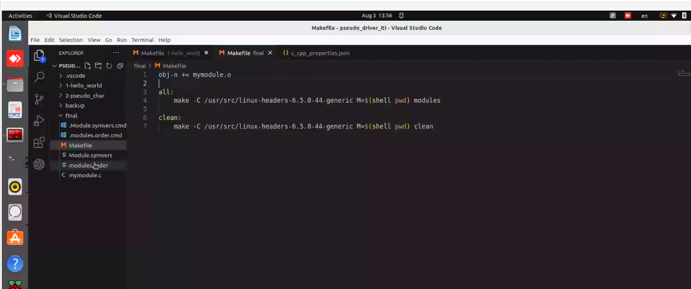
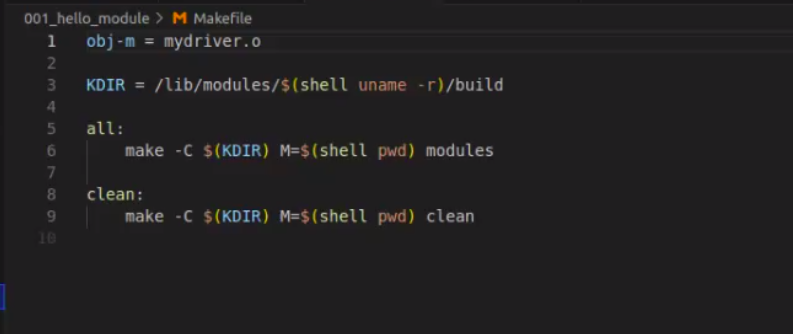
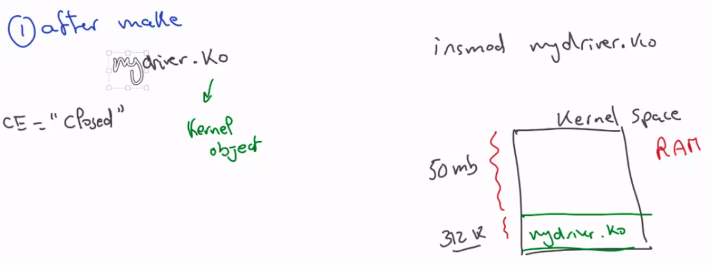

### device driver 

linux kernel module 

linux kernel
1. handel tasks 
2. interface during run time 

moudule can considered as driver 

how to inject module in kernel 
1. static ->
     dring linux compilation -> your module will be part of zImage -> 
     size of z image will increase ->startup of the kernel will be slower -> how to reduce linux startup ? -> reduce zImage drivers -> using system d and system v to reduce services needed at startup  -> startup of module it self will be faster 

2. during linux run time -> it can be loaded in any directory in rootfs "moule.ko" -> loading at run time "from user space "
size of .ko file will be larger than file .o if it was statically compiled -> startup of module it self will be smaller 
- linux commands used 
    1. insmod -> insertmodule 
    2. rmmod -> remove module 
    3. modprob -> make same func of 1 annd 2 but take flags 
    4. lsmod -> list module in kernel 

why LKM if important 
1. to extend linuc functionality 
    - security 
    - file system 
    - devie dirvers 

LKM Syntax 
1. Header section 
    #include(kernel headers)-> it's code .c files are kernel source code -> you can get it from kernel repo 
    - location of header file in X86 
        1. uname -r -> print your liux version 
            when chose the linux headers make sure its comparable with linux source code version 
    /usr/src/linux-header/includes 
    * no use of user space library is linked with kernel module 
2. code section 
    - C code with sime restriction (linux give you waht you need)

    - no main function -> becouse kernle has main function 
    - it has module init function 
        ```C 
        int Mykerel (void){
            // should return intger 
        }
        ``` 
    - module deinitialization 
        ```c 
        void funcname (void){
         // should reutn void    
        }
    - add your function to macro functon 
        ```c 
        module-init(mykernelinin)
        module-exit(mykernel-deinit)
        MODULE_LICIENCE("GPL")
     ``` 
- never forget to add Module-license 
    becouse kernel core c code of kernel ompelemnted based in GPL 
## how to comiple your module 
make -C /lib/modules/5.15.0.117-geniric/build -M=/Path to your module 

-C for chage directory to make build  directoy 

1. Make file (Create)
    - call makefile Kernel 
    - pass obj-m variable .o file 
```make
    obj-m=mydriver.o

 make -C /lib/modules/5.15.0.117-geniric/build -M=/Path to your module 
``` 



- after compilation you will get a driver.ko -> ko kernel object this file is not excutable because its not important to be excutable in user space its important to kernel 

- sudo ismod driver.ko -> inject it to kernel _> demsg will show printed messg in init function and deinit function 


## what is obj-m and obj-y 
- obg-m -> build variable dynamically 
- obj-y -> build variable statically 
    your driver must be injected in menuconfig 
    -> make menuconfig 
    " " not include it 
    "*" compile it statically 
    "M" let it as module and compile it dynamically 

## why ko larger than .o(static with kernel )
// the init function must call in smae deriver to sure that no one can call it outside deriver use static 

static _ _init int Kernel-init(void){

}
function kernel-init 
1. initialize module 
2. delete --init section in RAM that include init functions and we willl remove it becouse no eed for init function after it initialize modules 

static _ _exit void kernel-deinit(void){

}
in static module i can't unlaod module 
if you will compile static no need for exit section because it compiled with kernel and i can't remove module form kenel itself 


if you compile dynamic    
 _exit section will still in RAM to give you ability to unload driver using rmod  

 -----------------------------------------------
 impelementation Notes 
 -----------------------------------------------
 mount -t proc -> proc is a data structur for kenel in RAM "how kernel store data in Ram in kernel space "

include <proc-fs.h> 

1. to cereate file under proc use proc_create(); 
2. operation file created under proc 
    1. read 
    2. write 
    -> two operations are system call 


## recive data from user 
from user ineed to send data to kenel 
use write system call -> copy_for_user() function 


## device driver catiegories 
1. character device > related to gpio 
2. block device -> related to storgae 
3. newtwork device -> wifi , eth 

ls /var/log 
delete kernel-log & sys log if its size large your computer will crash and go on recover mode 
