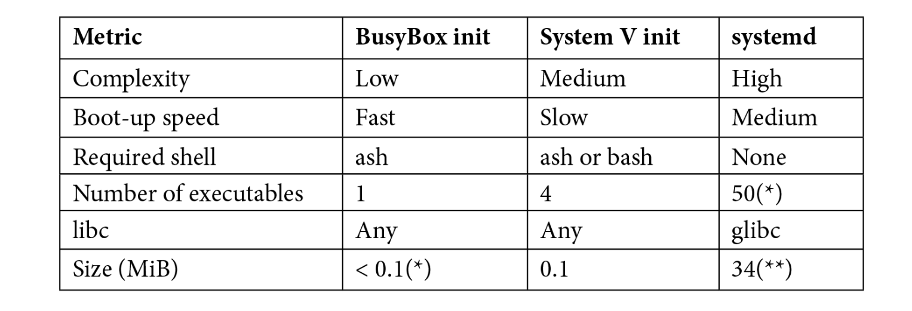
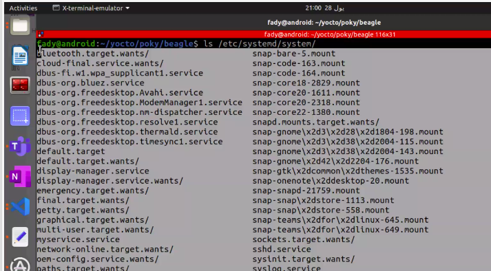

# inint process 
first process created by the kernel 
init=/sbin/init 
## init daemon to perform the following tasks:- 
* druing boot after kernel transfere control , the init program start other daemon programs and configure system parameter and other things needded to get system in the orking state 
* adopte processes that become orphanend as result of their immediate  terminating 
* it responds to any of inits immediate children terminataing by catching SIGCHLD signal and collecting return value to parent to prevent them from becomming zombie process 
* it has the system shutdeon 
## type of init process 
1. busyBox 
2. system v 
3. system d  


### busy Box 
BusyBox has a minimal init program that uses a configuration file, /etc/inittab ,to define rules to start programs at bootup and to stop them at shutdown. Usually,the actual work is done by shell scripts, which, by convention, are placed in the/etc/init.d directory.

## busybox init process " simple init process "
1. running application /sbin/init there is input file which is inittab  file -. configuration file 
* inittab format 
node :: action :: application to run 

* ::sysint ::/etc/init.d/rcs 
* rcS runs at bootup and  tterates over all the scripts in /etc/init.d/ with names that begin with a capital S
followed by two digits, and runs them in numerical order.

bash script to auto mount proc and sys -> to prevet user to make it every time These are the start scripts

* rcS loaction in etc because it is a configuration file  
* :: askfirst :/bin/sh ->ask user to press enter before run kernel 

## how the rcs script run and there is no shell running in this stage ?
because the shebang !#/bin/sh 
this indicates that this script is shell script it will run this script as bash script 

the program it will die becouse exit status of program
note : 
any interpreted languge need shebang to specify type of this script 

### system v init process 
why to switch from busybox to system v ?

* Firstly, the boot scripts are written in a well-known, modular format, making it easy
to add new packages at build time or runtime

* Secondly, it has the concept of runlevels, which allow a collection of programs to be
started or stopped in one go when switching from one runlevel to another

* if I am run only one init process -> 
you will init all nedded and unnedded functionality 
so we will partiotion our sysytem to run level which is equilvelnt to mode 
every node will specify functionalities to run 
mode 1 run  
    1. run gui 
    2. init wifi 
mode 2 
    1. deinit gui 
    2. deinit shell 
mdoe 3
    1. deinit wifi 
    2. deinit gui 
    3. init gui 

## why mode is used ? 
mode is used to init to reduce cpu load on system 

## how to switch between mode 
use commands -> init or telinit 

## wahts is the used of this modes in embedded? 

in embedded linux are divided into 2 modes 
mode 1 
    application mode 
        infotainment 
mode 2 
    maintinance mode 
         -> in service center when connect to OBD
         -> flashin 

* The init program starts the default runlevel given by the initdefault line in /etc/
inittab
### how to know current run level ? 
* use command : runlevel 
    output-> N 5 
    N -> there is no previose run level because the runlevel has not changed since booting
    5 -> the curren run level is 5 

Each runlevel has a number of scripts that stop things, called kill scripts, and another group that starts things
When entering a new runlevel, init first runs
the kill scripts in the new level, and then the start scripts in the new level

## inittab examels 
1. id:5:initdefault: // sets the default runlevel to 5
2. si::sysinit:/etc/init.d/rcS // runs the rcS script at bootup
3. l0:0:wait:/etc/init.d/rc //They run the /etc/init.d/rc script each time there is a change in the runlevel. This script is responsible for processing the start and
kill scripts

## how system v make this mode 
# 1. create a large dir which contain scripts for programs /etc/init.d such as : 
    1. tftp 
    2. blutooth 
# 2. create /etc/rc1.d 
# 2. create /etc/rc5.d 
# 2. create /etc/rc3.d
each run level has it own directory  

- The runlevel-handling script, /etc/init.d/rc , takes the runlevel it is switching to asa parameter. For each runlevel, there is a directory named rc<runlevel>.d :
There you will find a set of scripts beginning with a capital S followed by two digits, and
you may also find scripts beginning with a capital K . These are the start and kill scripts,
respectively

- wcd e will make a softlink in each mode directory for program tht we need on this  mode 
/etc/rc1.d
ln -s /etc/init.d/network K01network -> k stand for kill 
ln -s /etc/init.d/ssh  S02ssh -> s start stand for  

/etc/rc5.d
ln -s /etc/init.d/network s01 gui ->

what was in tftpscript 
switch ($1)
    start) 
    start-stop-daemon /usr/bin/tftp --start

    stop ) 
    start-stop-daemon /usr/bin/tftp --stop 

    * ) 

in rc.c 
```c 
int runlevel /* mode selector*/
switch(runlevel){ 
    case 1 :
        cd /etc/rc1.d/
        for (parsing to any files in that start with k and you will increment in prority )
        for(parsing(k),00){
            k01gui -> pass tp tftp stop
        } 

        for(parsing(s),00){
            s01shell ->pass start to tftp satrt to start application 
        }

}
``` 
## in inttab for system v 
node:runlevel: action : app -> this called node 
:s:sysinit:rcS -> will parse rcS file which mount  proc , sys and go to run level which  select in rcS ->init 2 run on runlevel 2 

:1: wait :rc 
:2: wait :rc 
-> we run rc in each level becouse it was check for workiing level 
it can formated as :1 2 3 4 5 : wait :rc 

change runnig mode will not run sysinit again it will got to wait  direct 

1. kernel will run on init 
2. will run inittab 
3. will excute :s:sysintin : rcs at first and this will parse rcs which will mount and then select run mode 
then return to inittab and run wait which is selected in rcS in run mode and pass it to rc.c whic will start applaications and and block application that slected in each run mode in switch case 

after complete starting change change running mode will not run :s:sysinit:rcS again 

bydefault you run in s node 
you can change default in boot args  init = /sbin/intin 5 -> in meanuconfig 
or make in extlinux in label called APPEND 


## problem of system v 

1. initialization done in serial >> because of for loop in every application and start it in series 

### system D 
## how system D is better than sytem V 
- The configuration is simpler and more logical

- There are explicit dependencies between services, rather than a two-digit code that merely sets the sequence in which the scripts are run.

- It is easy to set the permissions and resource limits for each service, which is
important for security. 

- Services are started in parallel, potentially reducing boot time

# note -> systemd not support musl library or uClib working with glibc 

type of process in linux 
1. forground -> process runnig an user can make an interact with it 
2. back ground process -> process runnig and user cant make interact with at 
3. oriphin process -> 
    when process init process creat process 2 and process 3 -> so process 2 was parent to process 3 if process 2 get killed , init process will be parent of process 3 
4. zombie process ->  its a process that finished it work and dosen't return an exit status to it parent so parent cant complete its kill and free it resources for init tabel so ->it take space form kernel process space which is limited to run specific number of process at a time 
5. daemon process -> it's a back ground process in concept but it  can't be forground process its was an services run applications in back ground "jobs" command viwe runs back ground process 

## is an init process
/sbin/bin -> sotflinked to /lib/systemd/system -> which is a c apllication 

there is 2 main directories in systemd 
1. /etc/system/systemd-> contain configuration -> edit part any edit you need to make done here 

2. /lib/systemd/system/  

## unit concept 
unit : A configuration file that describes a target, a service, and several other things

srvice : A daemon that can be started and stopped 

target : A group of services, similar to, but more general than, a System V init runlevel. There is a default target that is the group of services that are started at
boot time



unit was partitioned to  

    1. service -> run application 
    2. mount   -> mount 
    3. network -> setip
    4. automount ->  
    5. socket  -> realted to ports 
    6. traget  -> 

# each unit has a specific way to write it 
1. service -> run application in back ground as daemon process it will run without user interaction 

how to write srvice 
go configuration  : - 
/etc/systemd/system
touch myservie.service 
vim myservie.service 
-> header section 
[unit]
    description  =" .. "
    documentation=" url if it available"
    SourcPath    =" path of application ". 
    /*service dependincies*/
    After = give it another "unit file" - run 
    myservice after "unit file" was runed .
    don't wait for its completion .
    wants = give it another "unit file" and run it and wait it to successfully run and then run myservice .
    Before       = give it another "unit file" run myservice before run the passed unit file "unit file" dont wait completion of myservice 
    requires = give it another "unit file" run my service and wait tell it was successfully run  and then the passed unit file .
[service] 
    type = type of process you need to create -> { simple , oneshot , forking }
            1. simple   -> if my service create process and myservice get killed , process also get killed 
            2. one shot ->  used for initialization -> for any application give funtionality direct 
            3. forking  -> if myservice create child process and myservice get killed -> init process will be parent of child process  you should write in execstop to kill process 
    Execstart= application to run -> only one application can be wriiten here  systemctl start  -> run Execstart variable
    Execstop = run this application when you send stop sigal to the service    systemctl stop  ->  run Execstop variable
    workdir  = path of directory tht contain applicaation 
    restart  =  on-faliure -> if application go to faliure state restart it aging / always -> restart applcaiton if it finish it work 
    restart sec = 3 -> wait 3 second befor restart 
    // service + apllcation = daemon prpcess 

# out going dependencies 
They are used mostly to create dependencies between targets
- Requires: A list of units that this unit depends on that are started when this unit is started
- Wants :A weaker form of Requires ; the units listed are started but the current unit is not stopped if any of them fail
- Conflicts : A negative dependency; the units listed are stopped when this one is started and, conversely, if one of them is started, this one is stopped. 

# incoming dependencies 
which are used to create links between services and targets


### how systemD boots the system 
Now, we can see how systemd implements the bootstrap. systemd is run by the kernel
as a result of /sbin/init being symbolically linked to /lib/systemd/systemd . It runs the default target, default.target , which is always a link to the desired target, such as multi-user.target for a text login or graphical target for a graphical environment
as a result of /sbin/init being symbolically linked to /lib/systemd/systemd . It runs the default target, default.target , which is always a link to the desired target, such as multi-user.target for a text login or graphical target for a graphical environment

# list service and its curent state 
``` bash 
systemctl list-units --type service
``` 
# list targets 
```bash 
systemctl list-units --type target
```
### lets ceaete servive 
1. service name touch -> service .service 
    [unit]
        want= touch -> mynetwork 

    [service]
    type= simple 
    ExecSatrt=ping 192.162.1.10 -> qemu ip 
    restart= always
    restartsec = 3 
    workdir= /usr/bin


2. network service 

    [uinit]
    name="enps 3"

    [network]
    ip=192.168.1.9
    subnet=255.255.255.0


systemctl 
1. start -> start service 
2. stop -> stop service 
3. cat 
4. edit 
5. get-default -> .target which is some of services 
    [isntall]
    wantedBy=graphic.target 
6. set-default 

## process of creating services 
systemctl list-dependcies 
any service you will create service -> /etc/systmd/system 
touch my service.service 
which containg unit and service  and install 

when  systemctl enable myservice 
will see  install -> 'wantedBy=graphic.target'  and see that it is belong to which target "graphic.target" 
 in graphical.target will create softlink for service under /etc/systmd/system 
 # to show default target 
 systemctl get-default
 # to change default target 
 systemctl set-default multi-user.target 