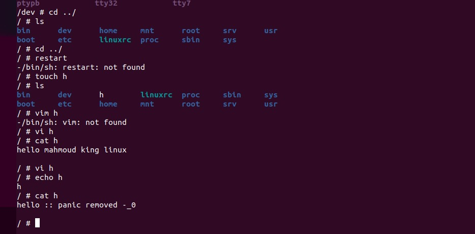

# Booting kermel using busybox in Qemu 

## whats is busyBox 
1. BusyBox combines tiny versions of many common UNIX utilities into a single small executable. -It provides minimalist replacements for most of the utilities you usually use.
2. written with size-optimization and limited resources in mind to reduce run-time memory usage.

## how to use busy box 
1. clone busybox 
```bash 
git clone https://github.com/mirror/busybox.git
cd busyBox 
```
2. configure busybox 
```bash 
make meanuconfig 
```
* from setting -> select build as static (no shared library )
* you can pass the path of crooscompiler to configuration to be sure that you will compile busybox with the right compiler for target cpu 

3. build busybox 
```bash 
make # this will generate all .o files for program that will be used in your image 
make install # this will collect all .o files gernated after build under one directory _install 
```

4. mount your sd card 
```bash 
sudo losetup -f --show --partscan sd.imag # you can replace sd .image with its path 
# /dev/loop#
sudo mount /dev/loop12p1 ~/sdcard  #path to directory you need to mount this partion of sd card on it "this will be mounted for boot partiotion "
sudo mount /dev/loop12p1 ~/sdcardp2 # this will be mounted for ext4 rootfs  partiotion 
```
5. create root file system 
```bash 
cd ~ 
mkdir rootfs 
rsync -a ~/busybox/_install/* ~/rootfs # copy all content of _install to rootfs 

# create missing directoreis 
mkdir boot dev etc home mnt proc root srv sy

```
6. create inittab 
```bash 
cd ~/rootfs/etc/
touch inittab 
# nobe : dev if used : action : app ro run with action
# inittab file 
::sysinit:/etc/init.d/rcS
# Start an "askfirst" shell on the console (whatever that may be)
ttyAMA0::askfirst:-/bin/sh
# Stuff to do when restarting the init process
::restart:/sbin/init
```
7. creating rcS script 
```bash 
cd ~/rootfs/etc/
mkdir init.d
cd init.d 
touch rcS 

#!/bin/sh
# mount a filesystem of type `proc` to /proc
mount -t proc nodev /proc
# mount a filesystem of type `sysfs` to /sys
mount -t sysfs nodev /sys
# mount devtmpfs if you forget to configure it in Kernel menuconfig
#mount -t devtmpfs devtempfs /dev
```
8. make rcS script excutable
```bash 
sudo chmod +x etc/init.d.rcS 
```
9. run Qemu 
```bash 
cd ~ 
sudo qemu-system-arm -M vexpress-a9 -m 128M -nographic -kernel ./quboot/u-boot -sd ~/gitrepos/EmbeddedLinux/manulecustomization/sd.img
```
10. set bootargs 
```bash 
# bootargs is a variables that are passed to kernel to configure its work in kernel start operation 

setenc bootargs 'console=ttyAMAo root=/dev/mmcblk0p2 rootfstype=ext4 rw rootwait init=/sbin/init'
saveenv 
#console -> specify for kernel what terminal will show booting logs on it 
#root -> specify for kernel the directory of rootfs file system 
# rootfstype -> specify the type of partition that contain rootfs 
# rw -> rootfs will be readabl and writable 
#rootwait -> specify kernel to make pooling wait until mount all directories of rootfs 
#inint -> will be the init process will run after kernel fullu booted '
```
11. load kernel on its address in RAM 
```bash 
# load kernle in ram 
fatload mmc 0:1 ${kernel_addr_r} zImage 
#load dtb file in ram which contain all adresses of board peripherlas 
fatload mmc 0:1 ${fdt_addr_r} vexpress-v2p-ca9.dtb
```
12. boot usig bootz 
```bash 
bootz ${kernel_addr_r } - ${fdt _addr_r }
```
## finaly kernel painc are removed also my panic 


