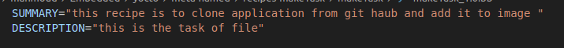
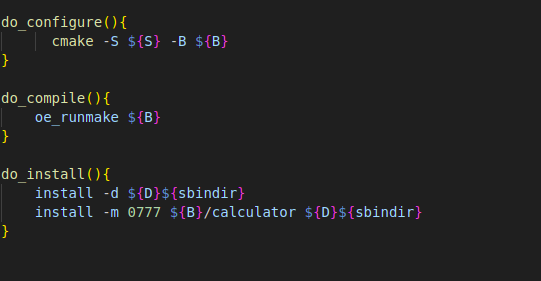

# camke task : run cmake amd make in recipe to create output in rootfs 

## create new recipe in meta-hamed layer
```bash
cd /meta-hamed/
mkdir recipes-makeTask
mkdir recipes-makeTask/makeTask 
touch makeTask_1.0.bb 
```

## add description and summary of recipe 



## add Liciense of recipe 
**set liciense to be as MIT** 
- set liciens in variable **LICENSE**
``` bash 
LICENSE="MIT
```

**set checksum of license**
- set checksum of liciense in variable **LIC_FILES_CHKSUM** 

```bash 
LIC_FILES_CHKSUM="file://${COMMON_LICENSE_DIR}/MIT;md5=0835ade698e0bcf8506ecda2f7b4f302"

# COMMON_LICENSE_DIR -> is a variable carry LICINSE directoty in poky 
# md5 carry chechsum calculted for the MIT file in COMMON_LICENSE_DIR wich is calculated by 
# md5sum [path]/MIT 
```

## clonning apllication from github 
```bash 
SRC_URI="git://github.com/FadyKhalil/DemoApp.git;protocol=https;branch=main"
SRCREV="720c663c5fd7246b4b42c5205d74db7d9784b5b2"

``` 
- **SRC_URI will downlaod files from github and copy it to work dir to be able to compile using bitbake**

- protocol -> protocol of web connection 
- branch -> carry branch name whic you application are pushed in 

- **SRCREV**
- carry the sha one hash of the commit you need to clone 

- **inherite cmake calss**
```bash 

inherit cmake
#In Yocto, classes (.bbclass files) provide a mechanism to encapsulate common functionality that can be shared across multiple recipes. They help streamline and standardize the build process, making it easier to manage and maintain complex build systems. Here are the key benefits of using classes in Yocto recipes
DEPENDS="cmake"

#ourrecipe depend on cmake recipe 

```
## edit source and destiation and build directories pathes

**S="${WORKDIR}/git"**

**B="${WORKDIR}/build"**

**D="${WORKDIR}/image"**

## three tasks are in our recipe 




- **do_configure** 

    - will run cmake and copy output od cmake into the build directory 

- **do_build**

    - will run makefile taht will compile the files that are in the build directory 

- **do_install**

    - will copy the output application from build directory to rootfs of the output image 


