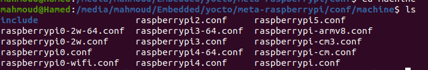
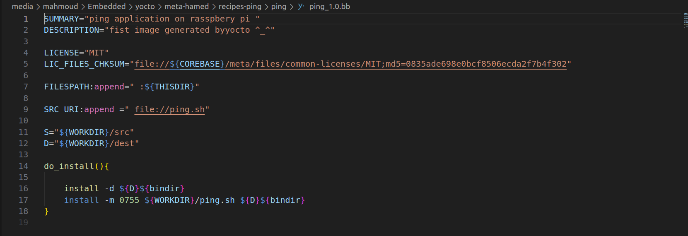
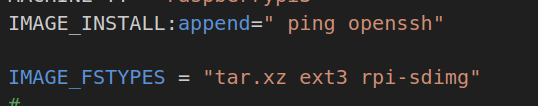

# insert a ping application in image for rasspberypi 
- **add new build directory for new image** 
```bash 
source oe-init-build-env ping-build 
```
## select machine rasspberypi 
- **we need to clone meta rasspberypi** 
```bash 
git clone https://github.com/agherzan/meta-raspberrypi.git
```
- **in local.cof file we have to set machine as rasspberypi** 



- copy machine name in local.conf under build environment deirectory 


- **add recipe for pingapplication that will compile and fetch application to add it in iamge** 

- 

- FILESPATH:append= " THISDIR" 
    - is to add the current directory for bitbake to search in for the the cuurent ping program 

- SRC_URI:append= " file://ping.sh"
    - add the ping application to src_uri to copy it in the work directory 

- do_install(){

    install -d ${D}${bindir}
    insatll -m 0755${WORKDIR}/ping.sh ${D}${binfdir}
}

- will create an directory in destination /bin and add the applciation in it 

-**now we need to add application in image so we must add its recipe  in tha IMAGE_INSTALL variable will do this in local.conf file under build directory 



- **to create an sdcard image in output of build of bitbake add this line 
    - IMAGE_FSTYPES = " tar.xz ext3 rpi-sdimg"

