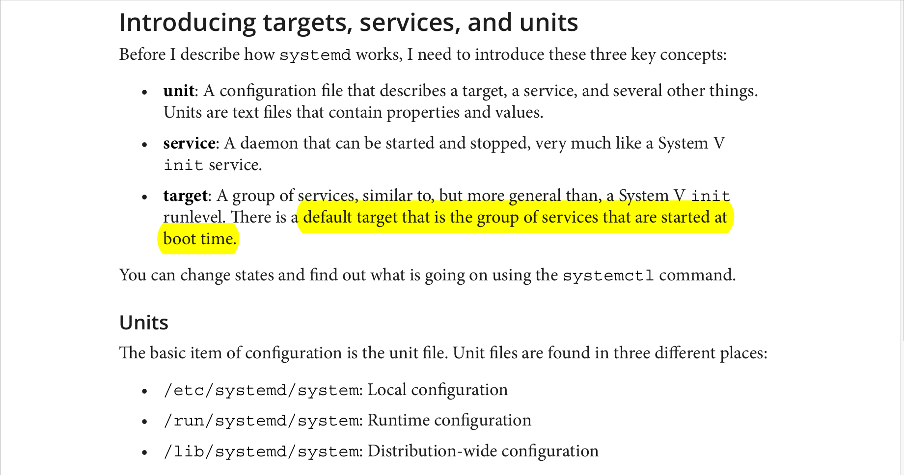
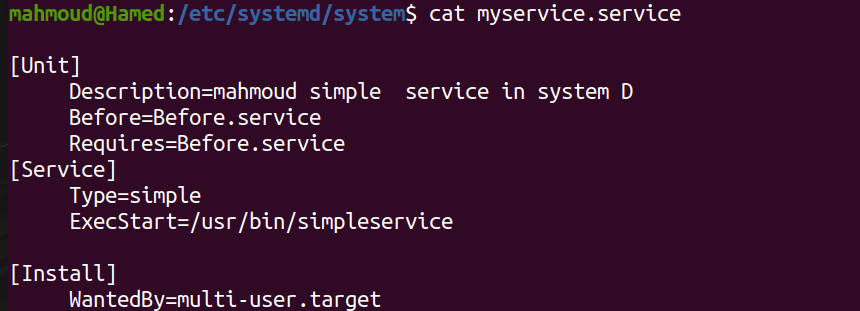
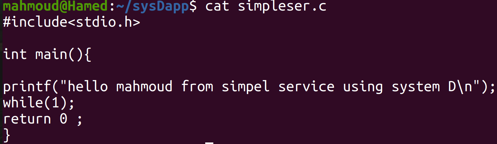
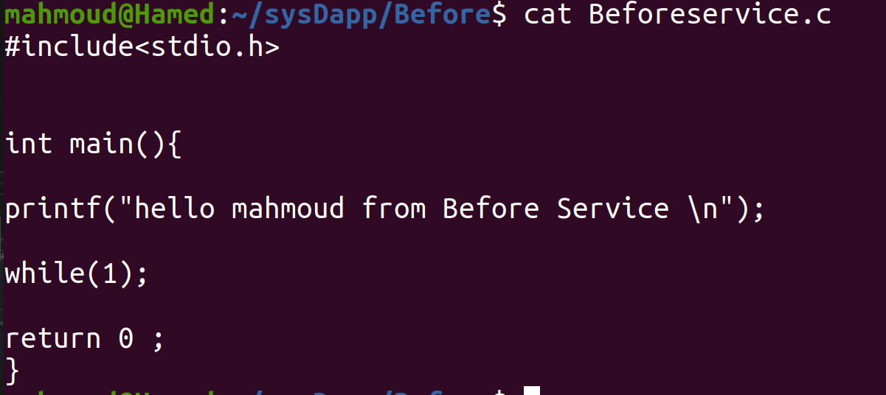
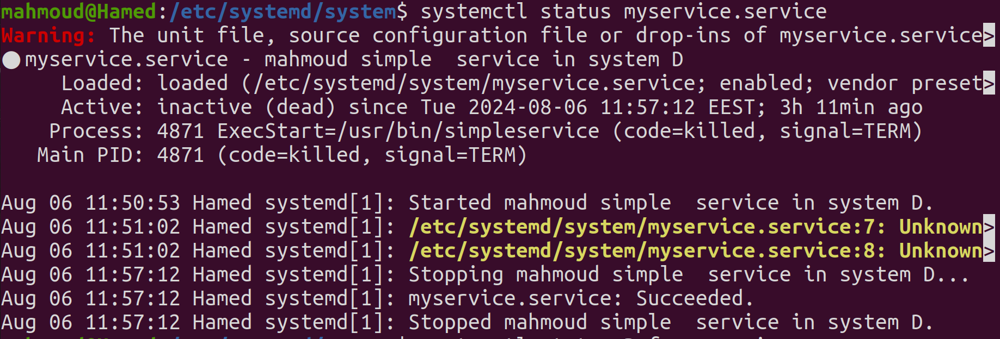
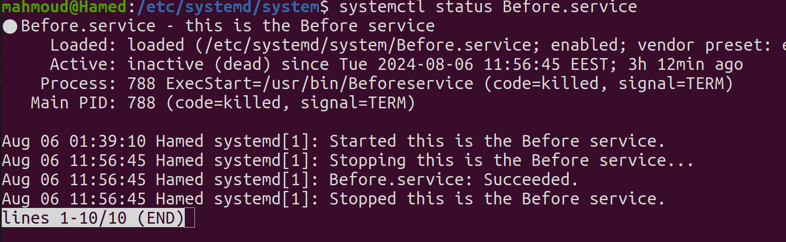
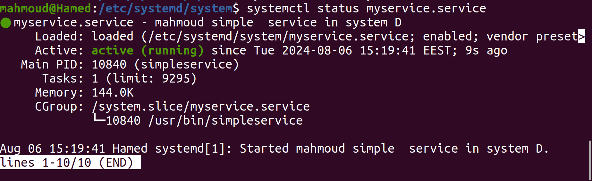
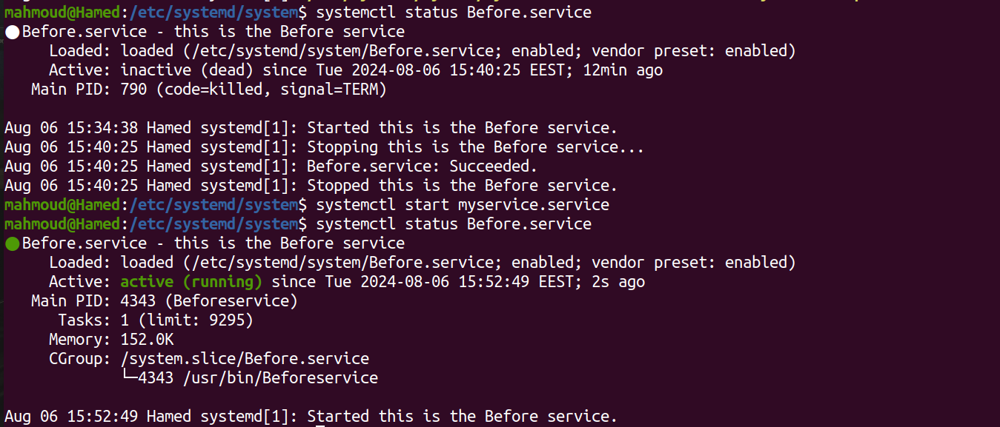

# system D task create two services depend on each other 

## system D structure 



## lets create our 1st service 
### steps 
```bash 
cd /etc/systemd/system 
touch myservice.service 
sudo vim myservice.service 
``` 
-> /etc/systemd/system -> is the configuartion file that contain the description of service and its running application

#### content of my serice.service 



[Unit]
-> Descriprion: contain description of my service 

[Service]
-> Type=simple -> this mean if myservice create a child process and myservice get killed  the child process also get killed 

->  Before=Before.service -> Before mean that Before.service will reun before myservice.service run 

-> Requires=Before.service -> This creates a dependency. If you specify Requires=Before.service, then Before.service will be started whenever your service is started. If the required service fails to start, then your service will not start.

-> ExecStart=/usr/bin/simpleservice -> this the application will run whrn myservice.service will run 

[Install]

->  WantedBy=multi-user.targete -> this is the target wichi is a group of services related to each other ->  when tihs target start myeservice.service will rum also 

## lets create our apllication 
apllication will be an C application that print sentence when service run 


->while(1); -> this make sevice run continously after print sentence if while(1) missed the service will satrt and after it finsih its job will retuen 0 and terminate so when you check its status you will find that servie not active 

-> compile application 
```bash 
gcc myservice.c -o simpleservice 
#move output binary to /usr/bin 
sudo cp simpleservice /usr/bin 
``` 
## lets write application of Before service 


->  compile application 
```bash 
gcc Beforeservice.c -o Beforeservice
#move output binary to /usr/bin 
sudo cp Beforeservice /usr/bin 
``` 
## lets check status of 2 services 
1. myservice


2. Berfore service 



## lets run myservice and as a result of it running Before servie will also run 
- starting myservice.servie 

- checking status of Before.service 



